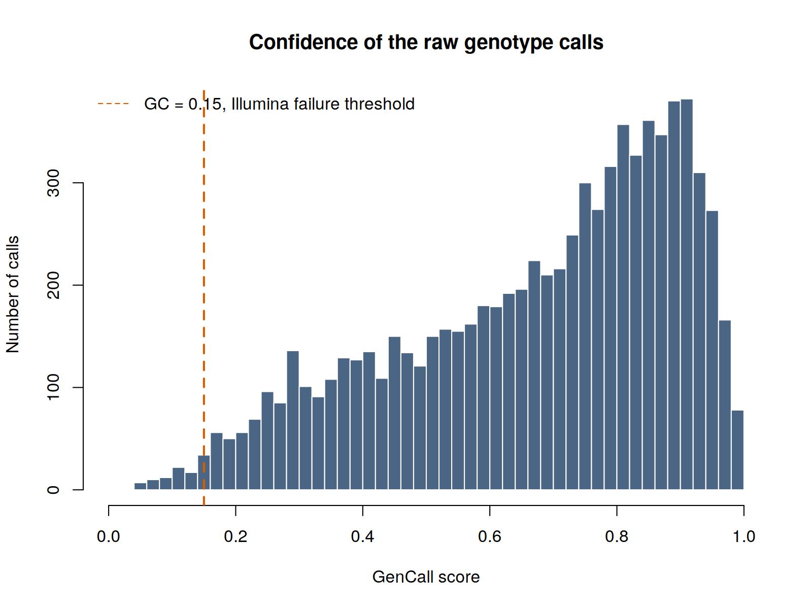

Every other page in this guide starts from a clean PLINK dataset. This one is about how that
dataset comes into existence, and about the decisions taken before it exists that constrain
everything afterwards.

Two of them matter most. Which array was used, which fixes what can ever be measured or imputed.
And whether the cohort was genotyped on one platform or several, which in a rare cancer is
usually several, because the samples were collected over fifteen years.

```bash
~/gwas_tutorial/
├── example_data/            a real Illumina Final Report, one sample
├── scripts/01A_study_design/
└── results/raw/
```

::: {.callout-tip title="What you need"}
`plink` (version 1.9) as well as `plink2`, and `Rscript`. The long format used in Step 02 is a
PLINK 1 input, which is why both are needed on this page and only `plink2` elsewhere.
:::

::: {.callout-note title="About the example data"}
`example_data/` holds three Final Reports and an array manifest, generated from `pdac_demo` by
`scripts/00_make_example_raw_data.R` with the project seed 2026.

They are synthetic for a reason that this guide takes seriously: a real Final Report contains the
genome-wide genotypes of an identifiable person, and a manufacturer's manifest is not ours to
redistribute. Everything on this page therefore runs on data we are entitled to publish, exactly
like every other section.

The artefacts injected into them were calibrated on a real Illumina GSAMD-24v3 report, so the
numbers behave as they do in practice. Where a measurement from that real file is quoted below,
it is quoted as a measurement; the file itself is not reproduced.

| Injected | Amount |
|---|---|
| Variants, samples | 8,000 across 3 samples |
| GenCall distribution | bimodal, median 0.73, 1.1% below the 0.15 threshold |
| No-calls | about 1.4%, reported as `-`, a few with a `NaN` score |
| Indel probes | 7.7%, reported as `I`/`D` |
| Minus-strand design | 42.6% of variants |
| Positional names carrying an older build | 25% of variants, 104 also on the wrong chromosome |
| Variants absent from the manifest | 6% |
| Strand-flipped block in sample 3 | 200 variants, to make the merge fail |
:::

---

## Choosing an array

Before any file exists, someone chooses a platform. The intuition is that a bigger array is a
better array. The evidence says otherwise.

Verlouw and colleagues compared 28 arrays, 10 from Affymetrix and 18 from Illumina, on content,
coverage, imputation quality and clinically relevant genes [doi:10.1038/s41431-021-00917-7]{.mark}.
Their central finding is that genome-wide coverage correlates strongly with the number of variants
on the array but **does not correlate with imputation quality**, which is what actually determines
whether the array is usable for a GWAS. After imputation, essentially every GWAS-oriented array
covers more than 90% of known GWAS loci well. Their recommendation is to stop using coverage as a
selection criterion.

What should drive the choice instead:

| Consideration | Why it matters |
|---|---|
| Additional content | Pharmacogenetic star alleles, HLA tag variants, ACMG actionable genes. This is where arrays genuinely differ |
| Ancestry of the study | Coverage ranges from 2% to 84% in Europeans but only 2% to 40% in Africans. An array designed on European haplotypes tags other populations less well |
| Compatibility with what you already have | Consecutive arrays from the same manufacturer overlap surprisingly little |
| Cost per sample | A denser array means fewer samples for the same budget, and in a rare cancer sample size is the binding constraint |

::: {.callout-important title="Why this is a rare-trait decision, not a technical one"}
For a common disease with 50,000 cases available, array choice is a minor optimisation. For a
rare cancer it interacts with the thing you cannot buy: cases. Spending the budget on a denser
array means genotyping fewer people, and the power calculation in Section 7 of the manuscript
shows that at these sample sizes power is dominated by the number of cases, not by marker
density. The cheap, current, GWAS-oriented array is almost always the right answer.
:::

---

## 01 - What comes off the machine

**Why.** Almost every expensive error, wrong strand, wrong build, wrong allele coding, silently
low-quality calls, is visible in the raw export and invisible afterwards.

```bash
bash scripts/01A_study_design/01_inspect_final_report.sh
```

An Illumina array is scanned, the intensities are clustered by the calling software, and the
result is exported as a **Final Report**: one row per variant per sample, with the two called
alleles and a confidence score. Affymetrix platforms produce the equivalent from `.CEL` files
with different column names and the same logic.

Three things in the header must be recorded now, because recovering them later is painful: the
array manifest name, the calling software version, and the number of variants and samples the
file claims.



**The GenCall score.** Every call carries a confidence between 0 and 1. Illumina's guidance is
that calls below about 0.15 are failures. Note what that means: a low-confidence call is *not*
missing in the file. It looks like any other genotype unless you check. In this excerpt the
median is 0.72 and 1.4% of calls fall below the threshold.

::: {.callout-note title="A finding worth pausing on"}
In the full report this excerpt came from, the variants named by rs number have a median GenCall
of 0.720 and 1.2% failures. The variants named by position, which are the array's custom content,
mostly copy-number and gene-tiling probes, have a median of 0.441 and 4.5% failures.

The custom content on an array performs measurably worse than the standard backbone. If your
analysis depends on that content, check it separately rather than trusting an overall call rate
that the backbone dominates.
:::

### Who called the genotypes, and with what

Array and genome build are not the whole of provenance. **The calling software is part of it**,
because the same scanner output analysed by different software gives different genotypes.

| Platform | Calling software | Output |
|---|---|---|
| Illumina Infinium | GenomeStudio | Final Report, `.csv` |
| Illumina Infinium | [DRAGEN Array](https://www.illumina.com/products/by-type/informatics-products/microarray-software/dragen-array.html), local or cloud, the current path | genotypes, CNV, PGx star alleles, from `.idat` |
| Affymetrix / Thermo Fisher | Axiom Analysis Suite, APT | calls from `.CEL` |
| Affymetrix 5.0 / 6.0, legacy | [Birdseed and Birdsuite](https://www.broadinstitute.org/birdsuite/birdsuite-faq) (Broad Institute) | calls, plus copy-number-aware genotypes |

::: {.callout-important title="Two consequences that reach all the way to your association test"}
**The caller changes the genotypes.** On the same `.CEL` files, Birdseed and Birdsuite produce
identical calls outside copy-number variable regions and *different* calls inside them. Birdsuite
is copy-number aware and can emit genotypes such as `A/-` or `-/-` for a variant sitting in a
deletion; Birdseed either miscalls those or leaves them uncalled. This matters concretely for
anyone receiving legacy consortium data: PLINK's biallelic model has no way to represent a
hemizygous call, so converting Birdsuite output to `.bed` silently discards exactly the
information that made it better. Record which caller and which version produced your genotypes,
and keep the original output.

**The plate is baked into the calls.** Cluster-based callers need many samples at once. Birdsuite
is documented as requiring roughly one chemistry plate at a time, about 96 samples and no fewer
than 20 to 40, with the explicit warning that running several plates together introduces batch
effects the authors describe as unresolvable.

This is where batch effects are actually created: not during analysis, but during calling, before
the dataset exists. It is also why samples added to a study later cannot simply be appended. They
were clustered separately, so they carry a systematic difference from the original set. For a
rare cancer whose cohort accrues over a decade, this is the normal situation, not the exception,
and it is the reason recruitment centre and genotyping batch belong in the covariate file from
the very beginning.
:::

---

## 02 - From Final Report to PLINK, using the manifest

::: {.callout-important title="You need the array manifest, and it must be the right one"}
A Final Report names variants and gives their alleles. It does **not** contain coordinates,
the genome build, or the design strand. All three come from the **manifest**: the `.csv` file
the manufacturer distributes for each array product, free of charge.

Get the manifest for exactly the product and version named on the `Content` line of your report
header, and keep it with the raw data. This tutorial does not ship a manifest: it is the
manufacturer's file, and the one you need is the one matching *your* array, not ours.
:::

```bash
Rscript scripts/01A_study_design/02_report_to_lgen.R \
        example_data/example_final_report.csv \
        /path/to/GSA-24v3-0_A2.csv \
        0.15
```

Before converting anything, the script runs five checks. They exist because every one of them
caught a real error while this section was being written.

**1. Product.** Compares the `Content` line of the report with `Descriptor File Name` in the
manifest. On real data this is the check that fails most often, and it failed while this section
was being written: the report came from `GSAMD-24v3-0-EA`, the Global Screening Array with the
multi-disease drop-in and 730,059 variants, while the manifest to hand described `GSA-24v3-0_A2`,
the base product with 654,027 loci. Same family, different array, and 6% of variants unmappable
as a result.

**2. Size.** Loci in the manifest against variants in the report.

**3. Name matching.** How many report identifiers are found: **7,520 of 8,000, 94.0%** here, the
remainder being the variants deliberately left out of the manifest. The script also tests whether
stripping a `GSA-` prefix improves the match, because some manifests prefix their identifiers
while reports do not, and a merge on exact names then fails for every rs-numbered variant without
a single error message. That happened too. Below 90% the script warns.

**4. Genome build.** Taken from the manifest's `GenomeBuild` column: 38 for all matched variants
here. Note that the same array has an A1 manifest on GRCh37 and an A2 manifest on GRCh38.
Choosing the wrong one shifts every coordinate.

**5. A diagnostic worth running once.**

::: {.callout-warning title="Variant names are not coordinates"}
Some array identifiers look like positions, for instance `1:103380393`. It is tempting to parse
them instead of using the manifest. Measured on the example data:

| | |
|---|---|
| Variants with a positional name | 1,860 |
| Name position **equals** the manifest coordinate | 0 |
| Name position **differs** | 1,860 |
| Chromosome also differs | 97 |

The offsets here are 384 to 543 kb, the size of a build shift. On the real array this was measured
directly: of 5,745 positionally named variants, only 776 agreed with the manifest coordinate and
4,969 differed, because the names carry GRCh37 positions while the A2 manifest is GRCh38.
Coordinates read from names would be wrong for the great majority of variants and would look
entirely plausible. Nothing downstream would complain.
:::

### What the conversion does

**Strand.** The manifest gives the design alleles as `[A/G]` on the design strand, and
`RefStrand` says whether that is the plus strand of the reference. In the example data
**3,194 of 7,520 variants, 42.5%, are on the minus strand** and must be complemented before they
can be compared with plus-strand genotypes; the real array measured 43%. Skip this and you get
the wrong reference allele for nearly half the array, silently.

**Quality.** Calls below the GenCall threshold are written as missing rather than deleted, so the
loss stays visible as missingness for Section 1B to find. The threshold is an argument, and the
count goes in the log.

**Three things hide in the allele columns.** This is the one that surprised us:

| In the report | Count in sample DEMO001 | Treatment |
|---|---|---|
| `A` `C` `G` `T` | 7,292 | kept |
| `-` | 102 | no-call, written as missing |
| `I` or `D` | 606 (7.6%) | **indel**, dropped, and counted |

The array carries insertion and deletion probes. A filter written as "keep only A, C, G, T",
which is the natural thing to write, discards them along with the no-calls, and nothing says so.
Dropping indels is a defensible choice, since PLINK's biallelic model represents them poorly and
most GWAS analyse SNPs only. Doing it without knowing is not.

The per-sample log records all of it:

```
 sample calls no_call indel failed_gc unmapped written
DEMO001  8000     102   606        86      480    6793
DEMO002  8000     112   601       109      480    6759
DEMO003  8000     113   607       114      480    6757
```

---

## 03 - To binary, merged and repaired

```bash
bash scripts/01A_study_design/03_lgen_to_binary.sh
```

Each sample is converted independently, then samples are added to the merge **one at a time**.
That order matters in practice: Final Reports usually arrive one file per sample and genotyping
runs arrive months apart, so a new run is added by converting it and merging it in rather than
reprocessing everything. Merging incrementally is slower than a single `--merge-list`, but when a
conflict appears you know exactly which sample caused it.

::: {.callout-important title="What a merge conflict means, and what to do about it"}
On the example data the run reports:

```
  base: DEMO001
  DEMO002: merged cleanly
  DEMO003: merge conflict on 142 variants
    resolved by flipping 142 variants in DEMO003: it was a strand difference
```

A variant that shows three or more alleles once two samples are put together does not exist
biologically. It means the same variant was coded differently in the two files, and the usual
cause is a strand difference.

The tempting response is to exclude the offending variants, and it is the wrong one: it hides the
problem and leaves the rest of the dataset built on the same mistake. The right response is to
flip the strand of the sample that conflicts and retry. If the conflict survives the flip, the
samples were genuinely converted against different references, and that has to be fixed upstream
rather than patched here.

Note also why flipping *every* sample is wrong: it resolves this conflict and creates others.
Only the sample that disagrees should be changed, which is why the merge is done one sample at a
time.
:::

::: {.callout-important title="The repair almost nobody mentions"}
A variant that is monomorphic among the samples in hand shows only one allele, so PLINK writes
`0` in the other allele column of the `.bim`. That zero is not missing data, it is an
**unobserved** allele, and it breaks later merges, strand checks and imputation.

In the example, across three samples, **1,546 of 6,938 variants** carry such a zero: the fewer
samples you have, the more variants look monomorphic, and with a single sample it would be most
of them. The manifest knows what the second allele should be, so the script fills it in: take the
observed allele, look up the design pair, write the other one. **All 1,546 are repaired.**

Without this step the dataset looks fine and cannot be combined with anything.
:::

**Why binary.** A `.ped` stores roughly four bytes per genotype; a `.bed` packs four genotypes
into one byte. On chromosome 22 of the demonstration dataset the text export is 36 MB against
1.5 MB for the PLINK 2 native format.

| File | Content |
|---|---|
| `.bed` | the genotypes, packed binary, not human-readable |
| `.bim` | one row per variant: chromosome, ID, genetic distance, position, allele 1, allele 2 |
| `.fam` | one row per sample: family ID, individual ID, father, mother, sex, phenotype |

::: {.callout-note title="The formats you will meet"}
| Format | Files | Where it appears |
|---|---|---|
| Final Report | `.csv` | Illumina calling output |
| CEL / AxiomGT | `.CEL`, `.txt` | Affymetrix calling output |
| Manifest | `.csv`, `.bpm` | coordinates, alleles, strand, build |
| PLINK long | `.lgen .map .fam` | conversion bridge only |
| PLINK text | `.ped .map` | inspection, legacy tools |
| PLINK 1 binary | `.bed .bim .fam` | the working standard |
| PLINK 2 native | `.pgen .pvar .psam` | faster, supports dosages |
| VCF | `.vcf` / `.vcf.gz` | imputation servers, sharing, sequencing |
:::

---

## 04 - Pre-flight checks

```bash
bash scripts/01A_study_design/04_preflight_and_formats.sh
```

Four checks, each cheap now and expensive later. On the converted example, and on the
demonstration dataset for comparison:

| Check | Converted example | Demo dataset |
|---|---|---|
| Variants | 6,938 | 430,000 |
| Unplaced | 0 | 0 |
| Duplicated positions | 0 | 22 |
| Duplicated identifiers | 0 | 0 |
| Strand-ambiguous (A/T, C/G) | 82 | 2,430 |

The converted example is clean on the first three because the manifest supplied every coordinate
and the synthetic array carries one probe per position. Real arrays do not: they place several
probes at one coordinate when tiling a gene for copy-number calling, and a real GSA report
measured 255 duplicated positions in 6,677 variants. Run the check on your own data rather than
assuming.

**Strand-ambiguous variants** cannot be oriented by comparing alleles, because A complements T
and C complements G. They are the classic source of sign errors when combining studies, and
Section 5 shows what that costs.

**Genome build** is recorded nowhere in a `.bim`. A GRCh37 dataset analysed as GRCh38 gives
coordinates wrong by megabases, and nothing complains. Everything in this guide is GRCh38 with
identifiers in `chr:pos:ref:alt` form.

Note that even the curated demonstration dataset carries 22 duplicated positions and 2,430
ambiguous variants. Clean data are not the same as unchecked data.

---

## The problem that defines rare-cancer consortia

A cohort assembled over fifteen years across a dozen centres was not genotyped on one platform.
It cannot have been: the arrays used in 2010 are not sold today, and consecutive arrays from one
manufacturer overlap less than you would expect.

The obvious response is to impute everything to a common set of variants and analyse the result.
**This is wrong, and the way it fails is silent.**

Johnson and colleagues measured it, using among others the PanScan pancreatic cancer data
[doi:10.1007/s00439-013-1266-7, PMID:23334152]{.mark}. Assigning case and control labels
arbitrarily between two groups of healthy people genotyped on different arrays, and imputing from
the **union** of their genotyped variants, produced:

| Arrays compared | Spurious associations |
|---|---|
| Illumina 1M vs 550v3 | 0.20% of variants, about 2,000 false positives per million |
| Illumina 550v1 vs 550v3 (nearly identical) | 0.07% |
| Illumina 1M vs Affymetrix 6.0 | 0.53–0.63%, about 5,000–6,000 per million |

There were no true associations to find. Adjusting for array with principal components failed.
Post-imputation filtering, even at the extreme threshold of R² ≥ 0.98, did not remove the bias.

The correction is simple and counterintuitive: impute from the **intersection** of variants
genotyped on all arrays, not the union. Using less information eliminates the bias entirely, and
imputation quality holds up well even when only about 30% of the original variants remain.

::: {.callout-important title="What this means for your study"}
Establish at the design stage which platforms your cohort spans, and plan to either impute from
the intersection or impute each platform batch separately and meta-analyse (Section 5). This is
not a detail to settle during analysis: it determines how quality control and imputation are
organised.

And note what a 0.5% false-positive rate means at the scale of a rare-cancer GWAS. With a few
hundred cases you expect at most one real signal. Several thousand artefacts per million imputed
variants do not merely add noise; they can be the only thing in your Manhattan plot.
:::

---

## Key decisions on this page

- Which array, judged on additional content and on the ancestry of the study rather than on
  marker count, and weighed against how many samples the budget then allows.
- Whether to accept the genotyping facility's calling and quality thresholds or repeat them, and
  which caller and version produced the genotypes. On legacy Affymetrix data, whether the calls
  came from Birdseed or from the copy-number-aware Birdsuite changes what is in the file.
- Whether samples added later were called together with the original set or separately. If
  separately, batch is a covariate you must record, not an afterthought.
- The GenCall threshold, and whether failed calls are set to missing or deleted. Set to missing.
- Whether the manifest matches the product in the report header, not merely the array family,
  and which build it declares. If not, stop and get the right one.
- Whether indels are analysed or dropped, decided and counted rather than filtered away by a
  condition written for SNPs.
- If the cohort spans platforms: intersection-based imputation, or batch-wise imputation with
  meta-analysis. Decide before quality control, not after.

Next: [Genotyping quality control](../01B_genotyping_qc/01B_genotyping_qc.qmd).
