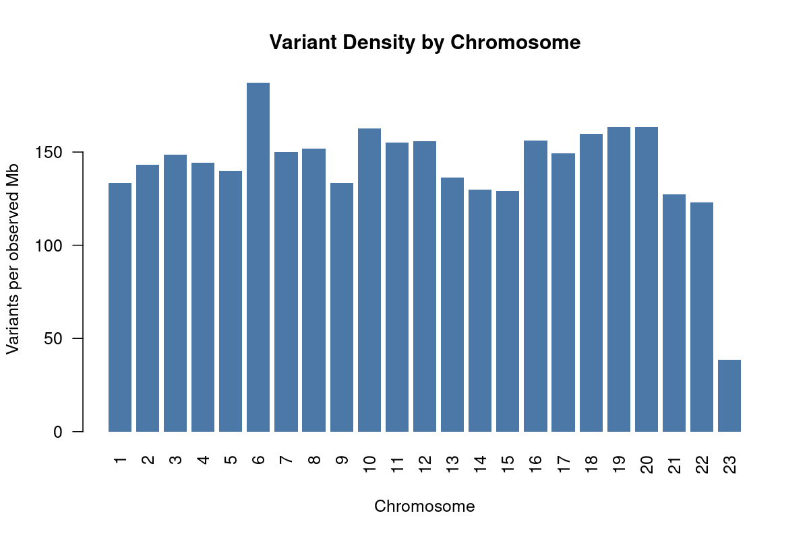
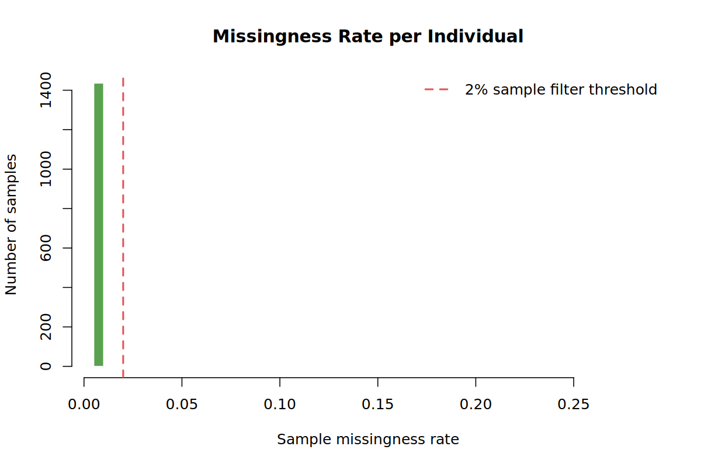
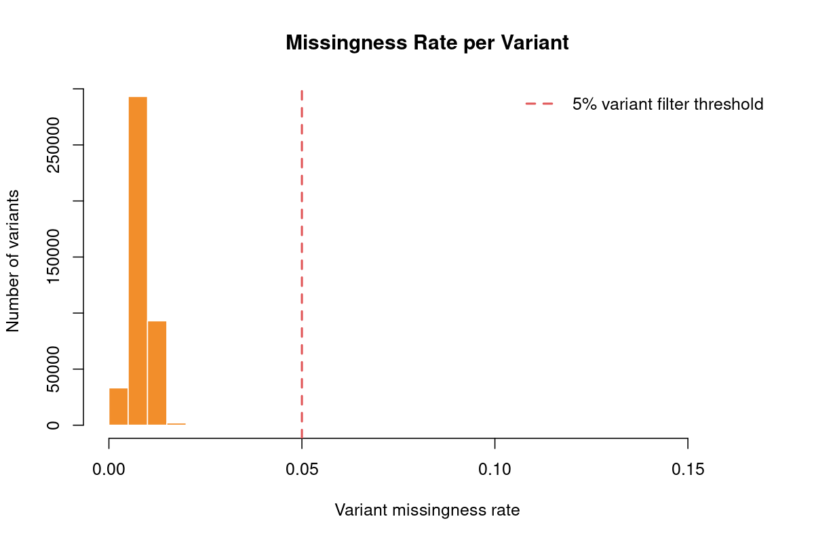
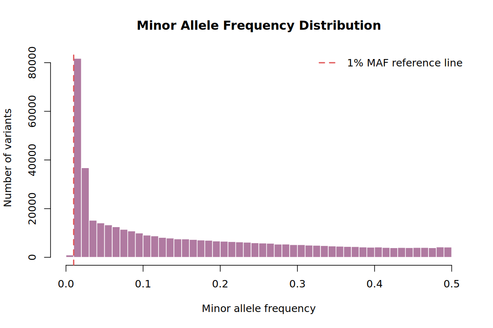
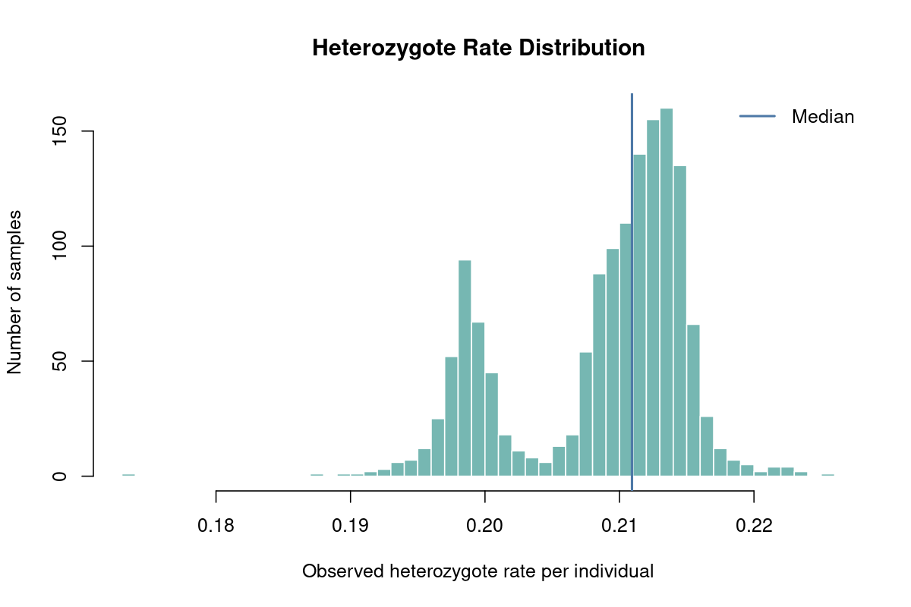
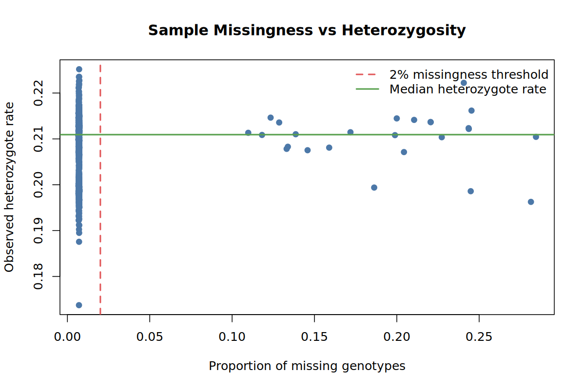
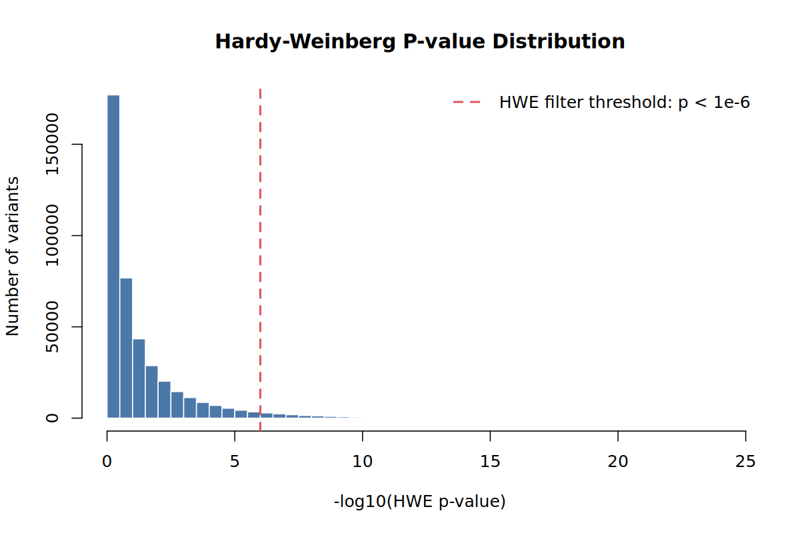

Real genotype data is never perfect. Some samples have too many missing calls, some variants are
poorly measured, sex labels can be wrong, and related individuals can break the independence
assumption used by standard GWAS tests. **Quality control (QC)** removes or flags these problems
before any association analysis.

This page is the canonical QC tutorial for the website. The source scripts live in
`sections/01B_genotyping_qc/scripts/`, but learners run the copied scripts from their tutorial
working folder:

```bash
~/gwas_tutorial/
├── demo_data/
├── scripts/01B_genotyping_qc/
└── results/qc/
```

::: {.callout-tip title="Before you start"}
Finish [Before you start](../../getting_started.qmd) first. You should have:

- `demo_data/pdac_demo.bed`
- `demo_data/pdac_demo.bim`
- `demo_data/pdac_demo.fam`
- `demo_data/phenotype.txt`
- working `plink2`, `plink`, and `Rscript` commands

All commands below are run from the project root, for example `~/gwas_tutorial`.
:::

::: {.callout-note title="About the example figures and tables"}
The commands write your local results to `results/qc/`. The figures and tables displayed on this
web page are example outputs from this repository folder:

```text
sections/01B_genotyping_qc/results/
```

Your own numbers may differ if you change thresholds, use a different random seed, or run the
workflow on another dataset.
:::

## What QC Does

The demo QC pipeline is intentionally stepwise. Each script runs one check, writes output to
`results/qc/`, and prints the next command to run.

```text
Raw demo genotypes: demo_data/pdac_demo.bed/.bim/.fam
    |
    | 01 Initial QC statistics
    | 02 Sample call rate
    | 03 Sex check
    | 04 Heterozygosity outliers
    | 05 Variant call rate
    | 06 Hardy-Weinberg equilibrium (flagged, not removed)
    | 07 Relatedness
    | 08 Minor allele frequency
    | 09 QC summary report
    v
Clean genotypes: results/qc/pdac_demo_08_filt.bed/.bim/.fam
    |
    | HWE within ancestry, applied in Section 2 after the split
    v
Analysis-ready: results/pca/pdac_demo_02_hwe_filt.bed/.bim/.fam
```

::: {.callout-note title="Why one step at a time?"}
For teaching, we do not hide the QC decisions inside one long command. Running one step at a
time lets you see how many samples or variants each filter removes. That is how you catch mistakes
early.
:::

## Run the QC Pipeline

## 01 - Initial QC Statistics

**Why.** Before removing anything, measure the dataset. This step creates baseline allele
frequency, heterozygosity, sample missingness, and variant missingness summaries.

```bash
bash scripts/01B_genotyping_qc/01_initial_qc_stats.sh
```

Main outputs:

```text
results/qc/pdac_demo_01_qc.afreq
results/qc/pdac_demo_01_qc.het
results/qc/pdac_demo_01_qc.smiss
results/qc/pdac_demo_01_qc.vmiss
results/qc/pdac_demo_01_qc_variant_density_by_chromosome.tsv
results/qc/pdac_demo_01_qc_variant_density_by_chromosome.png
results/qc/pdac_demo_01_qc_sample_missingness_histogram.png
results/qc/pdac_demo_01_qc_variant_missingness_histogram.png
results/qc/pdac_demo_01_qc_allele_frequency_distribution.png
results/qc/pdac_demo_01_qc_heterozygote_rate_distribution.png
results/qc/pdac_demo_01_qc_sample_missingness_vs_heterozygosity.png
```

**How to read the outputs.**

- `*.smiss`: one row per sample; `F_MISS` is the proportion of missing genotypes.
- `*.vmiss`: one row per variant; `F_MISS` is the proportion of samples missing that variant.
- `*.afreq`: allele frequencies; useful for checking rare and common variant content.
- `*.het`: per-sample heterozygosity and inbreeding coefficient information.

Example Step 01 plots:

::: {.panel-tabset}

### Variant Density

{fig-alt="Bar plot of variant density by chromosome."}

This plot checks whether variants are spread across the genome in a plausible way. Large missing
chromosomes or strong chromosome-specific gaps would suggest a data preparation problem.

### Missingness

:::: {.columns}
::: {.column width="50%"}
{fig-alt="Histogram of sample missingness."}
:::
::: {.column width="50%"}
{fig-alt="Histogram of variant missingness."}
:::
::::

Most samples and variants should have low missingness. The sample call-rate filter in Step 02
and variant call-rate filter in Step 05 act on these distributions.

### Allele Frequency

{fig-alt="Histogram of alternate allele frequencies."}

This plot shows how many variants are rare, low-frequency, or common. In a rare-cancer study we
avoid an aggressive MAF threshold because low-frequency variants may still be informative.

### Heterozygosity

:::: {.columns}
::: {.column width="50%"}
{fig-alt="Distribution of heterozygote rates."}
:::
::: {.column width="50%"}
{fig-alt="Scatter plot of sample missingness against heterozygosity rate."}
:::
::::

The scatter plot is a quick contamination check: samples with both unusual missingness and unusual
heterozygosity deserve attention before downstream analysis.

:::

## 02 - Sample Call Rate

**Why.** Samples with too many missing genotypes often reflect poor DNA quality, lab failure, or
platform problems. In a rare cancer GWAS, every sample is valuable, but very low-quality samples
can harm the entire analysis.

```bash
bash scripts/01B_genotyping_qc/02_sample_callrate.sh
```

This applies:

```text
--mind 0.02
```

`--mind 0.02` removes samples with more than 2% missing genotypes. In the demo run this removed
**25 samples**, leaving **1,436 samples**.

Main outputs:

```text
results/qc/pdac_demo_02_samples_callrate.mindrem.id
results/qc/pdac_demo_02_samples_keep.txt
results/qc/pdac_demo_02_filt.bed
results/qc/pdac_demo_02_filt.bim
results/qc/pdac_demo_02_filt.fam
```

::: {.callout-tip title="What to inspect"}
Open `pdac_demo_02_samples_callrate.mindrem.id` if you want to see which samples failed.
In real data, also check whether removed samples are disproportionately cases, controls, or one
contributing cohort.
:::

## 03 - Sex Check

**Why.** The genetic data on chromosome X should broadly agree with the recorded sex. A mismatch
can indicate a sample swap, data entry error, or contamination.

```bash
bash scripts/01B_genotyping_qc/03_sex_check.sh
```

The script writes:

```text
results/qc/pdac_demo_03_sexcheck.sexcheck
results/qc/pdac_demo_03_sexcheck_discordant.txt
results/qc/pdac_demo_03_filt.bed
results/qc/pdac_demo_03_filt.bim
results/qc/pdac_demo_03_filt.fam
```

In the demo run, this step removed **4 samples**.

::: {.callout-note title="Why this matters in a tutorial"}
Sex check is not only a biology check. It is also a sample identity check. A sex mismatch may be
the first visible sign that labels, sample IDs, or genotype files were mixed.
:::

## 04 - Heterozygosity Outliers

**Why.** Extremely high or low heterozygosity can signal contamination, inbreeding, or a
technical artefact. The inbreeding coefficient *F* compares observed with expected heterozygous
genotype counts across autosomal variants, and samples outside a standard-deviation band around
the mean are flagged.

In a multi-ancestry cohort that calculation cannot be done on everyone at once. The groups differ
in mean *F*, so the pooled standard deviation is inflated by the variance **between** groups and
the band becomes too wide to catch anything. The expected heterozygosity is also computed from
pooled allele frequencies, which biases *F* upward for every group at the same time. The script
therefore runs `--het` separately within each ancestry group, so that both the observed and the
expected heterozygosity use that group's own allele frequencies.

```bash
bash scripts/01B_genotyping_qc/04_heterozygosity.sh
```

Main outputs:

```text
results/qc/pdac_demo_04_het.het
results/qc/pdac_demo_04_het_outliers.txt
results/qc/pdac_demo_04_het_outliers.pdf
results/qc/pdac_demo_04_filt.bed
results/qc/pdac_demo_04_filt.bim
results/qc/pdac_demo_04_filt.fam
```

| | n | mean *F* | SD *F* | outliers |
|---|---:|---:|---:|---:|
| Pooled | 1,432 | 0.0683 | 0.0288 | **2** |
| European | 743 | 0.0061 | 0.0116 | 9 |
| African | 343 | 0.0049 | 0.0183 | 6 |
| East Asian | 346 | 0.0085 | 0.0138 | 5 |
| **Union across groups** | | | | **20** |

Read the mean before the outlier count. Pooled, *F* averages 0.068; within each group it falls to
between 0.005 and 0.009, which is what an inbreeding coefficient should be in a randomly mating
sample. Pooled, the statistic was not measuring inbreeding at all: it was measuring population
structure, and the width of the band it produced made the filter almost inert.

In the demo run, this step removed **20 samples**.

The baseline heterozygosity distribution from Step 01 is shown again here because it is the plot
that motivates this filter:

{fig-alt="Distribution of heterozygote rates used to motivate heterozygosity outlier filtering."}

::: {.callout-tip title="For rare cancer studies"}
Do not remove a case just because it is visually interesting. Remove it because it clearly fails
a documented QC rule. In the final report, keep the threshold and number removed.
:::

## 05 - Variant Call Rate

**Why.** Variants missing in many samples are unreliable. Missingness can reflect poor probe
performance, batch effects, or genotype calling problems.

```bash
bash scripts/01B_genotyping_qc/05_variant_callrate.sh
```

This applies:

```text
--geno 0.05
```

`--geno 0.05` removes variants missing in more than 5% of samples. In the demo run this removed
**8,480 variants**, leaving **421,520 variants**.

Main outputs:

```text
results/qc/pdac_demo_05_filt.bed
results/qc/pdac_demo_05_filt.bim
results/qc/pdac_demo_05_filt.fam
```

The Step 01 variant missingness plot shows why this filter exists:

{fig-alt="Histogram of per-variant missingness."}

## 06 - Hardy-Weinberg Equilibrium

**Why.** Strong departure from Hardy-Weinberg equilibrium more often indicates a genotyping error
than real biology. Two conditions must hold for the test to mean that, and most tutorials state
only the first.

The filter must be computed **in controls only**, because a true disease association legitimately
produces deviation in cases. And it must be computed **within a genetically homogeneous group**,
because the exact test assumes a single randomly mating population. Applied to a structured sample
it detects the Wahlund effect, that is, the allele-frequency differences between the constituent
populations, and reports them as genotyping failure.

```bash
bash scripts/01B_genotyping_qc/06_hardy_weinberg.sh
```

This step therefore **flags and does not remove**. It computes the test in the pooled control
series, records the result, and passes every variant forward. The exclusion happens after ancestry
assignment, in Section 2.

Main outputs:

```text
results/qc/pdac_demo_06_controls.txt
results/qc/pdac_demo_06_hwe.hardy
results/qc/pdac_demo_06_hwe_pvalue_distribution.png
results/qc/pdac_demo_06_hwe_exclude.txt
results/qc/pdac_demo_06_filt.bed
results/qc/pdac_demo_06_filt.bim
results/qc/pdac_demo_06_filt.fam
```

| Threshold, pooled controls | Variants below it |
|---|---:|
| 1e-6 | 14,899 |
| 1e-10 | 2,416 |
| 1e-15 | 168 |
| 1e-20 | 10 |
| 1e-30 | 0 |

Computed within each ancestry group instead, at the same `1e-6`, the counts are one in the
European group, none in the African and six in the East Asian: **seven variants**.

::: {.callout-important title="Why a gentler threshold does not fix it"}
The obvious response to 14,899 exclusions is to lower the threshold until the number looks
reasonable. It does not work, and the reason is worth seeing.

The ten variants that still fail the pooled test at `1e-20` have **no overlap at all** with the
seven that fail within a group. The two tests are not a lenient and a stringent version of one
procedure; they are measuring different things. No pooled threshold exists at which the test stops
detecting structure and starts detecting error.
:::

{fig-alt="Histogram of minus log10 Hardy-Weinberg p-values."}

::: {.callout-warning title="Two conditions, not one"}
Compute HWE in controls, and compute it within ancestry. Getting the first right and the second
wrong discards 14,373 variants that have nothing wrong with them, which in a rare-trait study is
power you cannot afford and did not need to lose.

Where discrete ancestry groups cannot be defined, as in admixed cohorts, ancestry-aware tests that
model individual ancestry directly are the appropriate substitute.
:::

## 07 - Relatedness

**Why.** Standard GWAS regression assumes unrelated individuals. Related pairs can inflate test
statistics if they are not removed or modelled.

```bash
bash scripts/01B_genotyping_qc/07_relatedness.sh
```

This step uses the phenotype file to protect rare cancer cases during pruning:

| File | Required columns | Coding |
|---|---|---|
| `demo_data/phenotype.txt` | `FID IID PHENO` | `1 = control`, `2 = case` |

The first two columns must match the family ID and individual ID in the `.fam` file. A header
line is allowed.

### KING, PI_HAT, and Thresholds

This step uses LD-pruned variants and KING kinship to find duplicate/twin or first-degree related
samples. It also runs the older PLINK 1.9 `--genome` command to report `PI_HAT`, which many GWAS
QC tutorials use for identity-by-descent checks.

`PI_HAT` and KING kinship are related but not the same scale. In ideal outbred pedigrees,
`PI_HAT` is roughly twice KING kinship, but real data will not match perfectly. This tutorial
reports both and uses KING for the final pruning list.

| Pair type | Degree | Approx. `PI_HAT` / relationship coefficient | Approx. KING kinship |
|---|---:|---:|---:|
| Unrelated | - | 0 | 0 |
| Parent-offspring | 1st | 0.5 | 0.25 |
| Full siblings | 1st | 0.5 | 0.25 |
| Half-siblings | 2nd | 0.25 | 0.125 |
| Grandparent-grandchild | 2nd | 0.25 | 0.125 |
| Uncle/aunt-niece/nephew | 2nd | 0.25 | 0.125 |
| First cousins | 3rd | 0.125 | 0.0625 |
| Identical twins or duplicate DNA sample | - | 1 | 0.5 |

The `0.1875` KING cutoff sits between the expected first-degree value (`0.25`) and second-degree
value (`0.125`):

```text
(0.25 + 0.125) / 2 = 0.1875
```

That means pairs above `0.1875` are treated as duplicate/twin or first-degree-or-closer for
pruning. Some tutorials use the nearby geometric-mean cutoff instead:

```text
sqrt(0.25 * 0.125) = 0.177
```

Both cutoffs try to separate first-degree-or-closer pairs from more distant relatives. Here we use
`0.1875` because it is common in GWAS QC scripts and easy to explain.

### Rare-Cancer Pruning Rule

Because this is a rare-cancer tutorial, the final pruning list is **phenotype-aware**:

- If a related pair above `0.1875` contains one case and one control, keep the case and remove the control.
- If both samples have the same phenotype, remove one sample to break the relationship.
- If a sample appears in many related pairs, removing that sample may resolve multiple pairs at once.

Main outputs:

```text
results/qc/pdac_demo_07_related_pairs.kin0
results/qc/pdac_demo_07_king_cutoff.king.cutoff.in.id
results/qc/pdac_demo_07_king_cutoff.king.cutoff.out.id
results/qc/pdac_demo_07_ibd_pi_hat.genome
results/qc/pdac_demo_07_ibd_pi_hat_annotated.tsv
results/qc/pdac_demo_07_ibd_pi_hat_summary.tsv
results/qc/pdac_demo_07_related_pairs_annotated.tsv
results/qc/pdac_demo_07_relatedness_summary.tsv
results/qc/pdac_demo_07_king_vs_pihat_comparison.tsv
results/qc/pdac_demo_07_king_vs_pihat_summary.tsv
results/qc/pdac_demo_07_pruning_components.tsv
results/qc/pdac_demo_07_relatedness_pruning_diagnostics.tsv
results/qc/pdac_demo_07_removal_decisions.tsv
results/qc/pdac_demo_07_removal_summary.tsv
results/qc/pdac_demo_07_removal_phenotype_counts.tsv
results/qc/pdac_demo_07_removal_list.txt
results/qc/pdac_demo_07_filt.bed
results/qc/pdac_demo_07_filt.bim
results/qc/pdac_demo_07_filt.fam
```

Example relatedness summary:

| Relationship category | Pairs | Unique samples |
|---|---:|---:|
| Duplicate or twin | 0 | 0 |
| First degree | 280 | 443 |
| Second degree | 4 | 8 |
| Third degree | 10 | 20 |
| Total samples before relatedness filter | NA | 1,412 |

Example pruning diagnostics:

| Metric | Value |
|---|---:|
| Samples before relatedness filter | 1,412 |
| KING pruning pairs > 0.1875 | 280 |
| Unique samples in KING pruning pairs | 443 |
| Relatedness components | 163 |
| Largest component samples | 6 |
| PLINK2 `--king-cutoff` removed samples | 166 |
| Phenotype-aware removed samples | 197 |
| Phenotype-aware removed percent | 14.0 |
| Controls removed | 167 |
| Cases removed | 30 |


::: {.callout-warning title="Review large relatedness loss"}
In the demo run, phenotype-aware pruning removed **197 samples**. That is a substantial sample
loss. If a real cohort loses many samples at this step, inspect `pdac_demo_07_pruning_components.tsv`,
`pdac_demo_07_relatedness_pruning_diagnostics.tsv`, and
`pdac_demo_07_removal_decisions.tsv` before continuing.
:::

## 08 - Minor Allele Frequency

**Why.** Very rare variants can be unstable in small studies. For PDAC we keep the threshold low
(`--maf 0.01`) because rare and low-frequency variants may be important in rare cancers.

```bash
bash scripts/01B_genotyping_qc/08_maf_filter.sh
```

The cleaned dataset is:

```text
results/qc/pdac_demo_08_filt.bed
results/qc/pdac_demo_08_filt.bim
results/qc/pdac_demo_08_filt.fam
results/qc/pdac_demo_08_afreq.afreq
```

In the demo run this step removed **6,858 variants**, leaving **414,662 variants** and
**1,215 samples**.

::: {.callout-note title="Why not use MAF 5%?"}
Many standard GWAS workflows use `--maf 0.05`. That is often reasonable for common-variant GWAS,
but rare cancer studies have fewer cases and may be especially interested in low-frequency
effects. This tutorial uses `--maf 0.01` as a teaching example of a less aggressive threshold.
:::

## 09 - QC Summary Report

**Why.** A reproducible GWAS needs a record of every threshold and how many samples or variants
were removed at each step. This final step creates one combined PDF report with the count table,
QC plots, relatedness diagnostics, and interpretation notes.

```bash
bash scripts/01B_genotyping_qc/09_qc_summary.sh
```

Main outputs:

```text
results/qc/pdac_demo_09_qc_counts.tsv
results/qc/pdac_demo_09_qc_summary.txt
results/qc/pdac_demo_09_qc_report.pdf
```

The generated report combines the same checks shown on this page into one review file:

- executive summary and index
- final sample and variant count table
- sample and variant retention plots
- initial QC distributions
- HWE, heterozygosity, and allele-frequency checks
- relatedness and phenotype-aware pruning diagnostics
- method notes for downstream interpretation

### Methods Notes and Interpretation

The report also summarizes the QC rules in a methods-friendly table. This is useful when you later
write the Methods section of a manuscript or need to explain exactly why a sample or variant was
removed.

| Level | Check | Threshold | Interpretation |
|---|---|---|---|
| Sample | Sample call rate | `--mind 0.02` | Remove samples with more than 2% missing genotypes. |
| Sample | Sex check | X chromosome F statistic | Detect sex discordance, swaps, or metadata errors. |
| Sample | Heterozygosity | Autosomal `F +/- 3 SD` | Remove strong contamination or heterozygosity outliers. |
| Sample | Relatedness | KING kinship `> 0.1875` | Remove duplicate/twin or first-degree-or-closer related samples. |
| Sample | Relatedness pruning strategy | Phenotype-aware | Prefer removing controls over cases in related case-control pairs. |
| Variant | Variant call rate | `--geno 0.05` | Remove variants missing in more than 5% of samples. |
| Variant | Hardy-Weinberg equilibrium | `--hwe 1e-6` in controls | Remove variants with strong control-only HWE deviation. |
| Variant | Minor allele frequency | `--maf 0.01` | Keep variants with MAF at least 1%; less aggressive for rare cancer. |

The main interpretation points are:

- **Rare cancer setting:** cases are precious, so sample-level exclusions should be documented.
- **Relatedness:** KING is used for final pruning, while PI_HAT is reported for comparison with older QC workflows.
- **Phenotype-aware pruning:** when possible, related case-control pairs are resolved by removing the control.
- **Large relatedness loss:** inspect relatedness components and removal decisions before continuing.
- **Final QC-pass data:** the Step 08 dataset is the input for ancestry checks, PCA, and association testing.

### Example Report Preview

The example report is a PDF. Some preview browsers automatically download PDFs if they are
embedded directly in the page, so the report is shown here as a launch panel instead.

::: {.callout-note title="Example Step 09 QC report"}
**File:** `sections/01B_genotyping_qc/results/pdac_demo_09_qc_report.pdf`

The report includes the final count table, retention plots, initial QC distributions,
HWE and MAF checks, relatedness diagnostics, and method notes.
:::

```{=html}
<div id="qc-report-preview" style="border: 1px solid #d0d7de; border-radius: 6px; padding: 0.75rem; background: #f8fafc;">
  <div style="display: flex; gap: 0.75rem; align-items: center; flex-wrap: wrap; margin-bottom: 0.75rem;">
    <button
      type="button"
      onclick="
        const panel = document.getElementById('qc-report-preview');
        const frame = panel.querySelector('iframe');
        frame.src = frame.dataset.src;
        frame.style.display = 'block';
        this.style.display = 'none';
      "
      style="border: 1px solid #2b6cb0; background: #2b6cb0; color: white; padding: 0.45rem 0.75rem; border-radius: 4px; cursor: pointer;">
      Show report preview
    </button>
    <a href="results/pdac_demo_09_qc_report.pdf" target="_blank" rel="noopener" style="font-weight: 600;">
      Open report in a new tab
    </a>
  </div>
  <iframe
    data-src="results/pdac_demo_09_qc_report.pdf"
    title="Example Step 09 QC report PDF"
    width="100%"
    height="760"
    style="display: none; border: 1px solid #d0d7de; border-radius: 6px; background: white;"
    allowfullscreen>
  </iframe>
</div>
```

::: {.callout-tip title="What should you do with the report?"}
Keep the report with your analysis outputs. It is a compact record of what happened to the data
before PCA and association testing, and it gives you the numbers needed for a Methods section.
:::

The demo run used in this page ended with:

| Stage | Samples | Variants | Samples lost | Variants lost |
|---|---:|---:|---:|---:|
| Raw data | 1,461 | 430,000 | 0 | 0 |
| Initial stats | 1,461 | 430,000 | 0 | 0 |
| Sample call rate | 1,436 | 430,000 | 25 | 0 |
| Sex check | 1,432 | 430,000 | 4 | 0 |
| Heterozygosity, within ancestry | 1,412 | 430,000 | 20 | 0 |
| Variant call rate | 1,412 | 421,520 | 0 | 8,480 |
| Hardy-Weinberg, pooled, diagnostic | 1,412 | 421,520 | 0 | 0 |
| Relatedness | 1,215 | 421,520 | 197 | 0 |
| MAF filter | 1,215 | 414,662 | 0 | 6,858 |
| Hardy-Weinberg, within ancestry (Section 2) | 1,215 | 414,655 | 0 | 7 |

Final retention in the demo run was **83.2% of samples** and **96.4% of variants**.

## PDAC-Specific Notes

Pancreatic cancer GWAS is a rare-cancer setting. That changes how we think about QC:

- Removing a case costs power, so sample-level filters should be justified and documented.
- Relatedness pruning should preserve cases when a related case-control pair can be resolved by removing the control.
- Overly aggressive MAF filtering can discard low-frequency signal.
- Population stratification is especially important in multi-consortium analyses.
- If many related samples are real family structure, consider relatedness-aware association methods downstream.

The final QC-pass dataset is the starting point for population stratification and PCA.

## References

- Purcell S, Neale B, Todd-Brown K, Thomas L, Ferreira MAR, Bender D, Maller J,
  Sklar P, de Bakker PIW, Daly MJ, Sham PC. [PLINK: a tool set for whole-genome
  association and population-based linkage analyses](https://pubmed.ncbi.nlm.nih.gov/17701901/).
  *American Journal of Human Genetics*. 2007;81(3):559-575. PMID: 17701901.
- Chang CC, Chow CC, Tellier LCAM, Vattikuti S, Purcell SM, Lee JJ.
  [Second-generation PLINK: rising to the challenge of larger and richer datasets](https://doi.org/10.1186/s13742-015-0047-8).
  *GigaScience*. 2015;4:7. This is the main citation for PLINK 1.9 and the
  second-generation PLINK codebase.
- Cog-Genomics. [PLINK 2.0 documentation](https://www.cog-genomics.org/plink/2.0/).
  Software documentation for the PLINK 2 commands used in this tutorial.
- Manichaikul A, Mychaleckyj JC, Rich SS, Daly K, Sale M, Chen WM.
  [Robust relationship inference in genome-wide association studies](https://pubmed.ncbi.nlm.nih.gov/20926424/).
  *Bioinformatics*. 2010;26(22):2867-2873. PMID: 20926424. This is the KING
  relatedness method used for kinship-based pruning.
- Wigginton JE, Cutler DJ, Abecasis GR. [A note on exact tests of Hardy-Weinberg
  equilibrium](https://pubmed.ncbi.nlm.nih.gov/15789306/). *American Journal of
  Human Genetics*. 2005;76(5):887-893. PMID: 15789306.
- [A reassessment of Hardy-Weinberg equilibrium filtering in large sample genomic
  studies](https://www.medrxiv.org/content/10.1101/2024.02.07.24301951v2).
  *medRxiv*. 2024. Preprint supporting careful interpretation of HWE filtering
  thresholds in large genomic studies.
