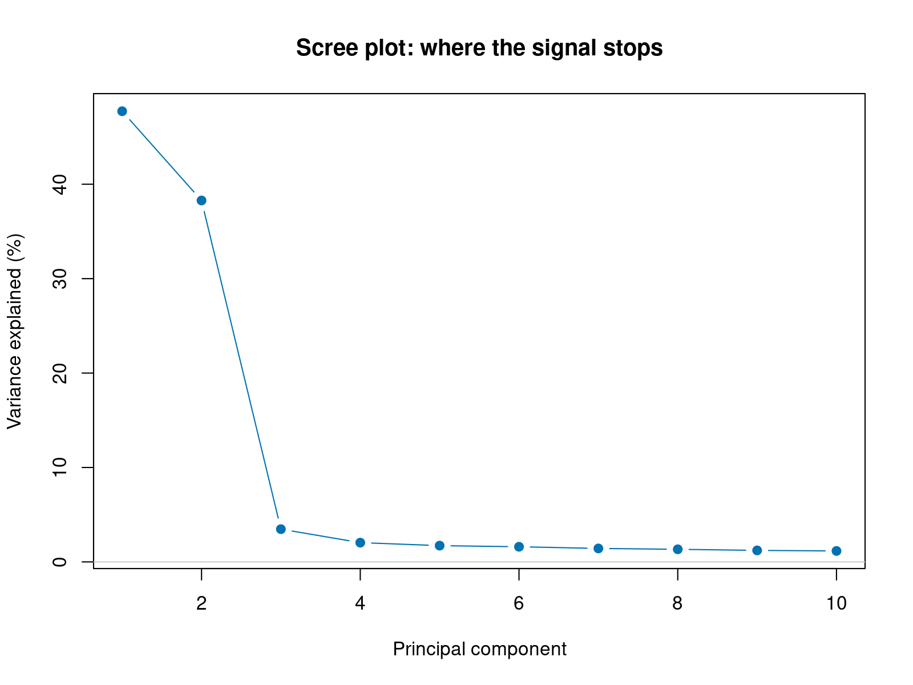
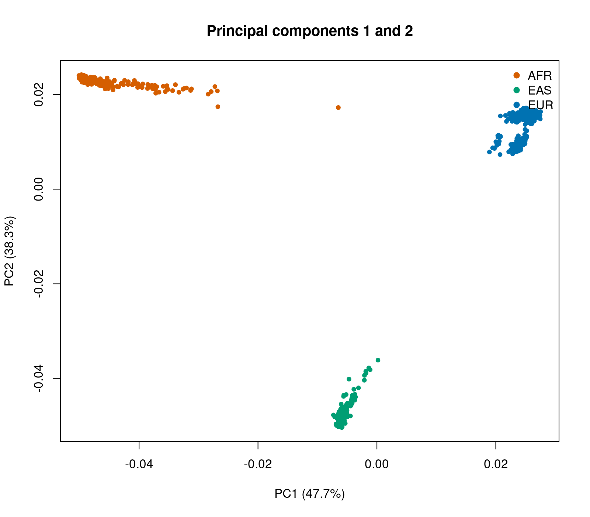
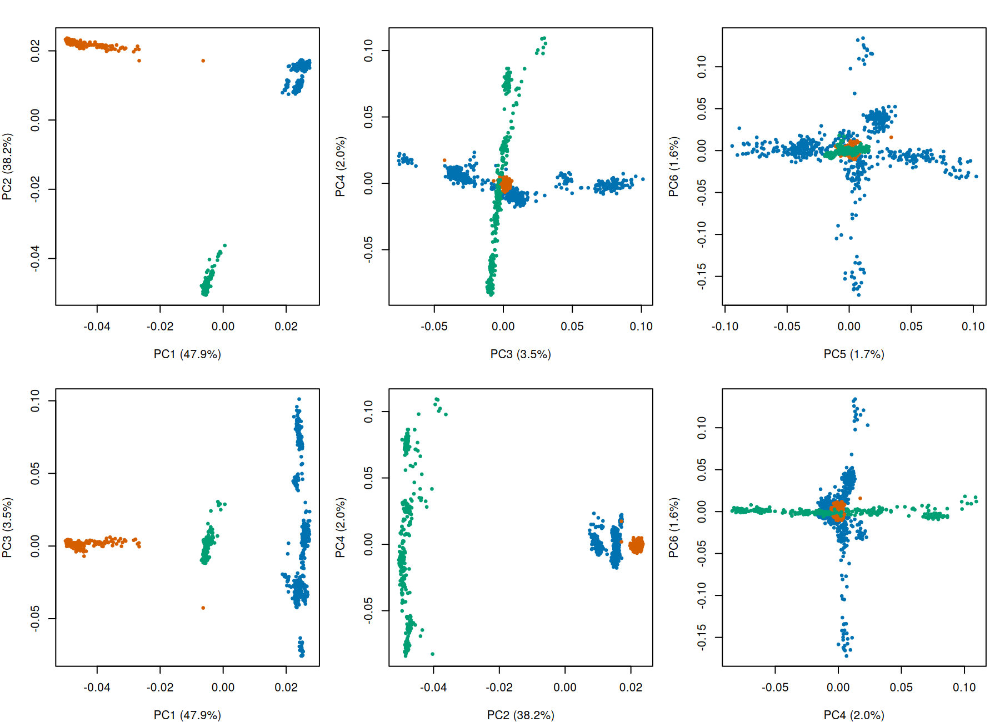
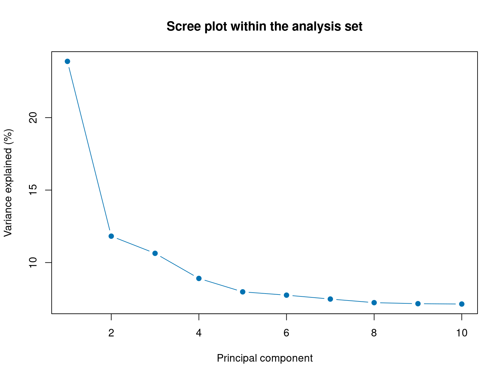

Population stratification is what happens when the people in a study differ in ancestry, and
those differences line up with case or control status. Allele frequencies vary between
populations for reasons that have nothing to do with disease, so if one ancestry group is
over-represented among cases, every variant whose frequency differs between groups will look
associated.

The damage is not only false positives. Uncorrected structure can equally **mask** a real
association, producing a false negative and a loss of power that leaves no trace in the output.
In a rare cancer, where the sample size gives no margin for either error, this is among the most
consequential steps in the whole workflow.

This page covers three things: seeing the structure, deciding what to do about it, and producing
the covariates that Section 4A will use.

```bash
~/gwas_tutorial/
├── demo_data/
├── scripts/02_population_stratification/
└── results/pca/
```

::: {.callout-tip title="Before you start"}
Finish [Genotyping quality control](../01B_genotyping_qc/01B_genotyping_qc.qmd) first. You need:

- `results/qc/pdac_demo_08_filt.bed/.bim/.fam`, the QC-passed dataset
- `demo_data/sample_ancestry.tsv` and `demo_data/phenotype.txt`
- working `plink2` and `Rscript` commands

All commands are run from the project root.
:::

::: {.callout-note title="About the example figures"}
Your commands write to `results/pca/`. The figures shown here are the outputs committed in
`sections/02_population_stratification/results/`, produced by exactly these scripts on the
demonstration data.
:::

---

## 01 - LD pruning

**Why.** Principal component analysis has to run on variants that are approximately independent.
Variants in linkage disequilibrium repeat the same information, and dense regions such as the
major histocompatibility complex on chromosome 6 would otherwise dominate the result, so that the
leading components describe local genomic architecture instead of ancestry.

```bash
bash scripts/02_population_stratification/01_ld_pruning.sh
```

On the demonstration data this keeps **222,338** variants and prunes away **192,324**. Losing
almost half is expected: it is redundancy being removed. The pruned set is used for PCA and
relatedness only, never for association testing.

::: {.callout-note title="The r-squared threshold is a decision, not a standard"}
`--indep-pairwise 50 5 0.2` uses a 50-variant window, a step of 5, and an r² threshold of 0.2.
A threshold of 0.1 (|r| ≈ 0.32) is more stringent; 0.2 (|r| ≈ 0.45) more permissive. Neither is
correct in the abstract. What is required is to report the value used and to confirm that the
leading components do not change materially when it is varied.
:::

---

## 02 - Principal component analysis

**Why.** PCA reduces the genotype matrix to a handful of uncorrelated axes, ordered by how much
variance each explains. It assumes nothing about population structure; structure is simply the
strongest biological signal in the variance that PCA summarises when a cohort spans continents.

```bash
bash scripts/02_population_stratification/02_pca_all.sh
```

Outputs are `pdac_demo_02_pca_all.eigenvec`, one row per individual, and
`pdac_demo_02_pca_all.eigenval`, the variance carried by each component.

---

## 03 - Looking at the result

```bash
Rscript scripts/02_population_stratification/03_pca_plots.R
```

Three plots, each answering a different question.

::: {.panel-tabset}

### Scree plot



How many components carry real signal? On the demonstration data PC1 explains 47.7% of the
variance and PC2 38.3%, then the curve collapses to 3.5% at PC3. That cliff is the signature of
discrete continental ancestry: two components separate three groups, and everything after is
noise and fine structure.

### PC1 versus PC2



Three clusters, cleanly separated. This is what a multi-ancestry cohort looks like, and it is why
the primary analysis cannot simply pool everyone.

### Higher components



The panel most often skipped, and the one most often needed. In a cohort that looks homogeneous
on PC1 and PC2, real structure frequently appears further down, and it confounds the association
test just as effectively. Always inspect at least PC1 through PC6.

:::

::: {.callout-important title="A caution about this demonstration"}
The separation here is unusually clean because the dataset was deliberately built from three
distinct continental groups. Real cohorts are messier: a predominantly European PDAC consortium
will show one diffuse cloud with gradients running through it, not three islands. The skill to
carry away is reading the scree plot and the higher components, not recognising a picture that
looks like this one.
:::

---

## 04 - Deciding who is analysed

**Why.** Seeing the structure is not the same as handling it. Three strategies are defensible.

| Strategy | What it costs | When it is right |
|---|---|---|
| Analyse the largest group alone | Discards data | Other groups too small to stand alone |
| Keep everyone, ancestry as covariate | Assumes effects are portable across populations | Groups are small and effects plausibly shared |
| Analyse each group, then meta-analyse | Nothing, but needs each group to be large enough | Genuinely multi-ancestry cohorts |

```bash
bash scripts/02_population_stratification/04_define_analysis_set.sh
```

On the demonstration data:

| | |
|---|---|
| QC-passed total | 1,215 |
| European | 611 |
| East Asian | 317 |
| African | 287 |
| **Analysis set** | **611: 219 cases, 392 controls** |
| Effective sample size | 562.0 |

The third strategy is the one to prefer whenever it is available, because it neither discards
data nor assumes that effect sizes transfer between populations with different causal-allele
frequencies and LD structures. Here the non-European groups are too small to form meaningful
strata, which is the situation of most real rare-cancer cohorts, so the analysis proceeds on the
European subset alone.

::: {.callout-note title="Effective sample size is the number that matters"}
4 × cases × controls / (cases + controls) = 562.0, not 611. In an unbalanced design the effective
figure is what governs power, and it is what should be reported. Section 4A returns to what this
number does and does not make detectable.
:::

::: {.callout-warning title="How the groups are assigned here"}
This dataset ships with true ancestry labels, which is a teaching convenience. In a real study no
such labels exist: the assignment comes from the PCA itself, or from projection onto a reference
panel such as 1000 Genomes or HGDP, with a threshold on the estimated ancestry proportion, 80%
being a common choice. Step 03 above is the check that the labels and the genetic data agree,
which is worth doing whenever metadata claims an ancestry.
:::

---

## 05 - Recomputing the components within the analysis set

**Why.** This step is frequently skipped, and skipping it is a mistake.

The components from Step 02 describe continental separation. Once the non-European individuals
are removed, those axes describe something that is no longer in the data. What remains, and what
can still confound the test, is fine-scale structure within Europe, and only a PCA computed
within the analysis set can see it. LD pruning is repeated for the same reason: which variants
are correlated depends on allele frequencies, which differ between populations.

```bash
bash scripts/02_population_stratification/05_pca_within_eur.sh
```



Compare this with the scree plot from Step 03. The cliff is gone. PC1 now explains 23.9% and PC2
11.8%, and the curve declines gently instead of collapsing, which is what within-population
structure looks like: continuous gradients rather than discrete groups.

::: {.callout-tip title="How many components should you keep?"}
Ten is a convention with no justification attached. The guide recommends three checks instead:

1. Inspect the scree plot for the point where additional components explain negligible variance.
2. Test each component for association with case status, which Section 4A does automatically.
3. Confirm that the genomic inflation factor and the leading associations are stable across a
   range of component counts.

If the results move materially between five and twenty components, that instability is itself the
finding and belongs in the paper.
:::

---

## 06 - The Hardy-Weinberg filter that had to wait

**Why.** Section 1B computed the Hardy-Weinberg test and deliberately excluded nothing, because
the test assumes a homogeneous population and there was not one yet. Now there is.

```bash
bash scripts/02_population_stratification/06_hwe_within_ancestry.sh
```

The test runs in controls, within each group, at the same `1e-6` threshold used before. A variant
is excluded if it fails in any group: a genotyping error is a property of the assay, so failing
anywhere is evidence against the variant.

| Group | Controls tested | Variants failing |
|---|---:|---:|
| European | 392 | 1 |
| African | 149 | 0 |
| East Asian | 176 | 6 |
| **Union** | | **7** |

Seven, against the 14,899 the same threshold flagged on the pooled sample. The difference is not a
matter of degree. Almost every variant the pooled test rejected was rejected for having different
allele frequencies in Europe, Africa and East Asia, which is true of a large part of the genome
and says nothing whatever about genotyping quality.

::: {.callout-note title="What this cost, and what it bought"}
Running the filter in the wrong place would have discarded 3.5% of the genome for no reason. It
would also have been invisible: the pipeline runs, the counts look plausible, and the association
test that follows is well controlled either way. The genomic inflation factor is 1.016 either way.
:::

---

## What you now have

`pdac_demo_02_pca_eur.eigenvec` holds the covariates for association testing, and
`pdac_demo_02_eur_keep.txt` defines who is analysed. Both feed directly into the next section.

## Key decisions on this page

- The r² threshold for LD pruning, reported and checked for stability.
- Which ancestry strategy: single group, pooled with a covariate, or stratified with
  meta-analysis.
- Whether individuals distant from the main cluster are genuine outliers or genuine diversity.
  Distance alone does not justify exclusion, and in a rare cancer every excluded case is a
  permanent loss of power. Document the number of components examined, the threshold, the number
  removed, and the effect of their removal on the inflation factor.
- How many components to carry forward, decided from evidence rather than convention.

Next: [Association testing](../04A_association_binary/04A_association_binary.qmd).
