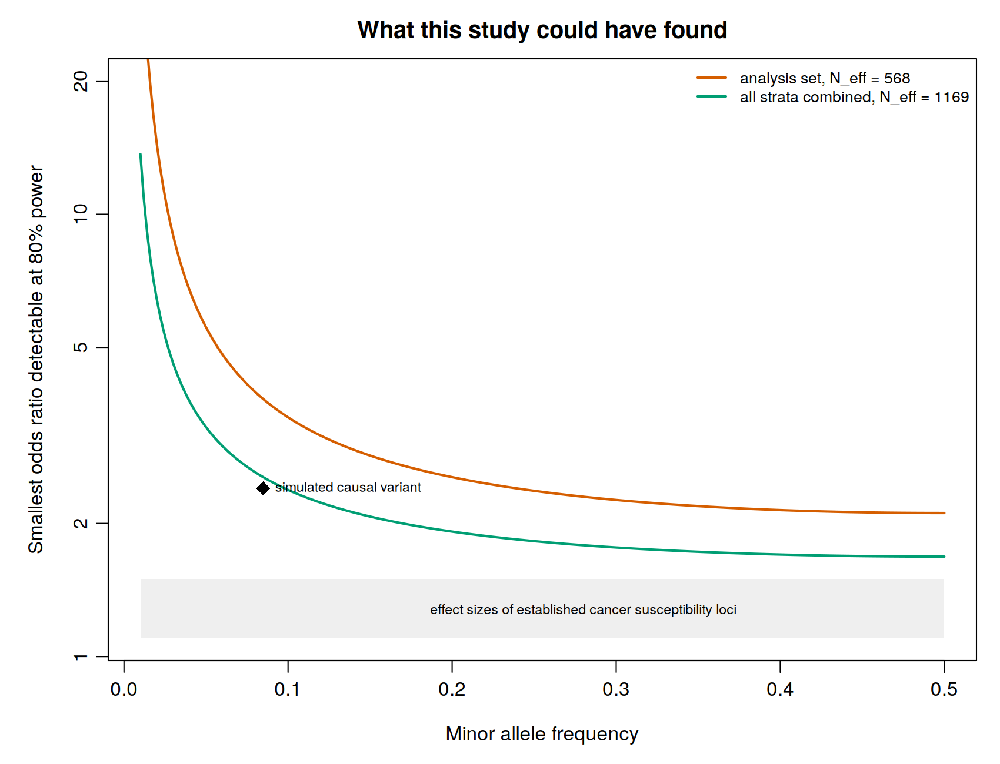
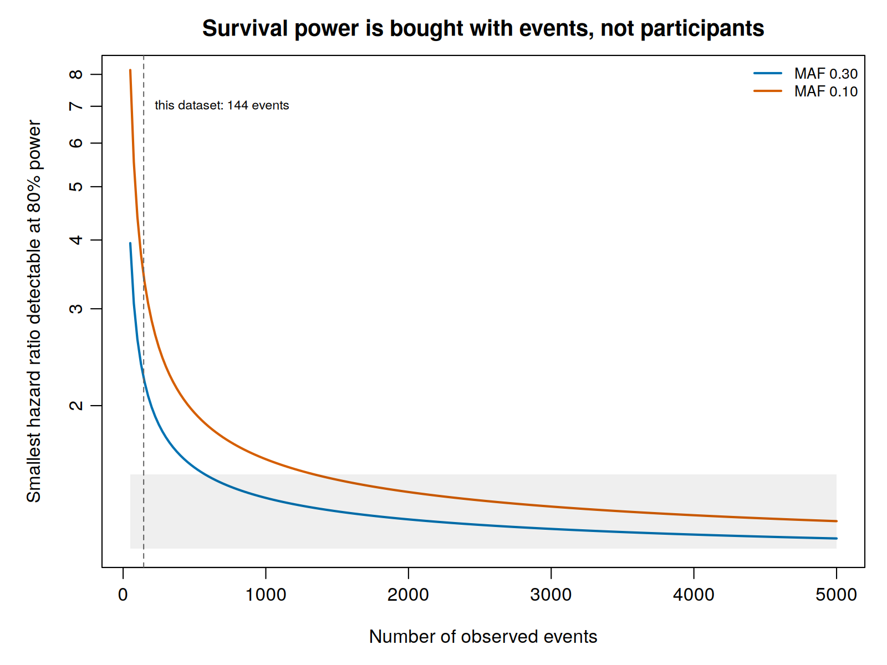

Power analysis has a reputation as a formality performed for a grant application and then
forgotten. In a rare and complex trait it is the step that decides which of the analyses in this
guide are legitimate at all, and it belongs exactly here: after the analysis set is fixed, and
before any association test whose result you will be tempted to believe.

The question it answers is narrow and useful. Given the people actually in hand, how large would
an effect have to be for this study to find it?

```bash
~/gwas_tutorial/
├── scripts/03B_statistical_power/
└── results/power/
```

::: {.callout-tip title="Before you start"}
Finish [Population stratification](../02_population_stratification/02_population_stratification.qmd),
which defines the analysis set. The comparison with all ancestries combined also uses
[Meta-analysis](../05_meta_analysis/05_meta_analysis.qmd).
:::

---

## The arithmetic, in three lines

Power depends on how much information the design carries about the genetic effect, and that
information is a product of three things:

$$\text{Fisher information} \;=\; N \times \pi(1-\pi) \times \operatorname{Var}(G), \qquad \operatorname{Var}(G) = 2p(1-p)$$

the sample size (**N**), the variability of the outcome (**π(1 − π)**), and the variability of the
genotype (**Var(G)**). Multiplying
by the squared effect gives the non-centrality parameter (NCP) of a one degree of freedom chi-squared
statistic, and power is the probability that the NCP exceeds the critical value set by the
significance threshold.

Each term earns its place, and each says something practical.

**Var(G) = 2p(1 − p)** means information collapses as a variant becomes rare. This is why
low-frequency variants are harder to identify, and why a rare disease does not confer any special ability to
detect rare variants.

**π(1 − π)**, where π is the proportion of cases, is maximised at π = 0.5. Therefore, a balanced design is
the most efficient one, and imbalance costs information that no analysis can recover.

**N** is the component that can be increased most directly through additional recruitment and investment.

::: {.callout-important title="Report the effective sample size, not the total"}
An unbalanced study behaves like a smaller balanced one:

$$N_{\text{eff}} = \frac{4 \, N_{\text{cases}} \, N_{\text{controls}}}{N_{\text{cases}} + N_{\text{controls}}}$$

On the demonstration data, 219 cases and 392 controls, **611 people behave like 562**. Past about
four controls per case the curve flattens, so recruiting a fifth or sixth control adds almost
nothing. If controls are cheap and cases are not, which is the usual situation in a rare cancer,
this is where to stop.
:::

---

## 01 - What this study could have found

```bash
Rscript scripts/03B_statistical_power/01_power_curves.R
```



| Minor allele frequency | Analysis set, N_eff 562 | All strata combined, N_eff 1,162 |
|---|---|---|
| 0.50 | 2.12 | 1.69 |
| 0.30 | 2.27 | 1.77 |
| 0.20 | 2.56 | 1.92 |
| 0.10 | 3.49 | 2.39 |
| 0.05 | 5.60 | 3.31 |
| 0.02 | 14.61 | 6.46 |

Those are the smallest odds ratios detectable with 80% power at *P* < 5 × 10⁻⁸. Read them against
the effects that actually exist: established cancer susceptibility loci have odds ratios between
1.1 and 1.5, the grey band on the figure. Nothing in that band is reachable at either sample size.

Put as power rather than as a threshold, the same fact is starker:

| | Power at MAF 0.30 | Power at MAF 0.10 |
|---|---|---|
| OR 1.2 | 0.0% | 0.0% |
| OR 1.3 | 0.0% | 0.0% |
| OR 1.5 | 1.0% | 0.0% |
| OR 2.0 | 45.0% | 2.5% |

::: {.callout-warning title="The result of this study was determined before it was run"}
A typical cancer susceptibility variant, odds ratio 1.3, had **no chance** of detection here. The
shape of the Manhattan plot in [Association testing](../04A_association_binary/04A_association_binary.qmd),
one peak and nothing else, was fixed by this table, not by the biology and not by the quality of
the analysis.

This is worth stating plainly because it changes what the result means. A scan that finds nothing
under these conditions has not failed. It has returned the correct answer for its size, and
reporting it as such, with this table alongside, is a contribution rather than an admission.
:::

### The two causal variants, and what power decided about each

The demonstration phenotype was simulated from two variants. Their generative effects are in
`truth.tsv`, released with the data, so for once the answer is known before the analysis begins.

| Locus | Risk allele | MAF | Generative OR | Power, analysis set | Power, all strata |
|---|:--:|---:|---:|---:|---:|
| *ABO* 9q34.2 | `A` | 0.39 | 2.60 | **99.1%** | 100% |
| TERT/CLPTM1L 5p15.33 | `C` | 0.49 | 1.50 | **2.0%** | 28.6% |

Read the two power columns and the result of the study is already written. *ABO* was going to be
found; TERT/CLPTM1L was not. Neither outcome says anything about the quality of the analysis, and
the Manhattan plot in
[Association testing](../04A_association_binary/04A_association_binary.qmd), one peak and nothing
else, is the picture this table predicted.

::: {.callout-note title="The risk allele is the reference allele"}
At both loci the allele carrying the effect is the reference, the first of the two in the
`chr:pos:ref:alt` identifier, and at *ABO* it is the **major** allele at frequency 0.61. An
association run reports the effect of the other allele, so at *ABO* it prints an odds ratio near
0.43. Its reciprocal, 2.3, is the number to compare with the generative 2.60. Allele orientation
is listed in [Meta-analysis](../05_meta_analysis/05_meta_analysis.qmd) among the errors that most
often go unnoticed; this is what one looks like.
:::

### What high power does to the winner's curse

An underpowered scan overstates the effects it does find, because the variants that cross the
threshold are those whose estimates happened to fall high. That is the winner's curse, and it is
worth knowing precisely when it applies.

Here it does not. At 99.1% power, *ABO* was going to be detected whatever the noise did, so there
is no selection to inflate the estimate. The recovered odds ratio is **2.34** against a generative
2.60, slightly below rather than above, which is what sampling error alone looks like.

The lesson survives the absence of the phenomenon, and is sharper for it: the winner's curse is a
consequence of low power, not a property of discovery. Ask for the power first. An effect
estimated at 2% power should never be carried into risk prediction, into meta-analytic weighting
or into the sample size calculation for a replication study; an effect estimated at 99% power can
be.

### Selection did operate, on which variant was named

One thing was still decided by noise. The variant at the top of the scan is
`9:133266804:G:T`, at *P* = 1.4 × 10⁻⁹, and it is **not** the causal one. The causal variant
`9:133273682:A:T` is third by posterior probability, at *P* = 4.4 × 10⁻⁹.

This is close to inevitable. Dozens of correlated variants in the region carry the same signal, and
the one that reaches the top is the one whose estimate the noise pushed furthest. Selection here
acts on the identity of the reported variant rather than on the size of the effect, and no amount
of statistical power removes it, because it is a property of linkage disequilibrium rather than of
sample size. It is the reason
[Fine mapping](../06_finemapping_annotation/06_finemapping_annotation.qmd) exists, and the reason a
lead variant should be reported as the top of a credible set rather than as a finding.

### What combining the strata buys, and what it does not

Across the three ancestry strata the effective sample size rises from 562 to 1,162, and power at
TERT/CLPTM1L from 2.0% to 28.6%. That is a large relative gain and it is still not enough: the
variant reaches *P* = 0.02 in
[the meta-analysis](../05_meta_analysis/05_meta_analysis.qmd), far short of genome-wide
significance, and its effect is known to be real because it was simulated.

That is the honest case for [meta-analysis](../05_meta_analysis/05_meta_analysis.qmd), and it is
stronger than a rescue would have been. Combining cohorts is not a remedy for an underpowered
scan; it is the only lever available, and this dataset shows how much more of it a real study
would need.

---

## 02 - Survival analysis obeys a different rule

```bash
Rscript scripts/03B_statistical_power/02_power_events.R
```



In a Cox model the partial likelihood compares, at each event time, the genotype of the individual
having the event with those still at risk. Only event times contribute a comparison, so the
information is

$$\text{Fisher information} = D \times \operatorname{Var}(G)$$

with *D* the number of observed **events**. Censored individuals enter the risk sets and add
nothing to the test.

On the demonstration data, restricted to the European analysis set:

| | |
|---|---|
| Individuals with follow up | 611 |
| Observed events | **140** |
| Censored | 471 |

**The number that governs power is 140, not 611.** With 140 events, the smallest detectable hazard
ratio at MAF 0.30 is 2.27, and a hazard ratio of 1.5 has 1.0% power.

Turning it round gives the number to put in a protocol:

| To detect, at MAF 0.30 with 80% power | Events required |
|---|---|
| HR 1.3 | 1,370 |
| HR 1.5 | 574 |
| HR 2.0 | 196 |

::: {.callout-important title="What this means for a rapidly fatal cancer"}
The way to power a survival scan is to raise the event count: enrich for individuals at higher
risk, or extend follow up. Recruiting more people who will be censored does not help, and a study
that reports several thousand participants may be, for this purpose, a small study.

There is an uncomfortable corollary specific to PDAC. Because survival is short, events accrue
quickly, which is the one respect in which this disease is easier than most. The binding
constraint is instead how many patients can be recruited and followed at all.
:::

---

## Key decisions on this page

- Whether the study is powered for the intended primary analysis. If it is not, say so in the
  protocol rather than discovering it in the discussion.
- The effective sample size rather than the nominal one, reported as such.
- Whether a planned secondary analysis, survival, subgroup, gene by environment or rare variant,
  has enough events or carriers to be run honestly, or should be pre-specified as exploratory.
  This is the decision most often skipped.
- Whether an effect estimate from this study is fit to be reused downstream, given how much the
  winner's curse inflates estimates at this power.
- Whether the answer to all of the above is that the study should contribute to a meta-analysis
  rather than stand alone. For a rare cancer it usually is, and recognising it early changes what
  is worth doing.
