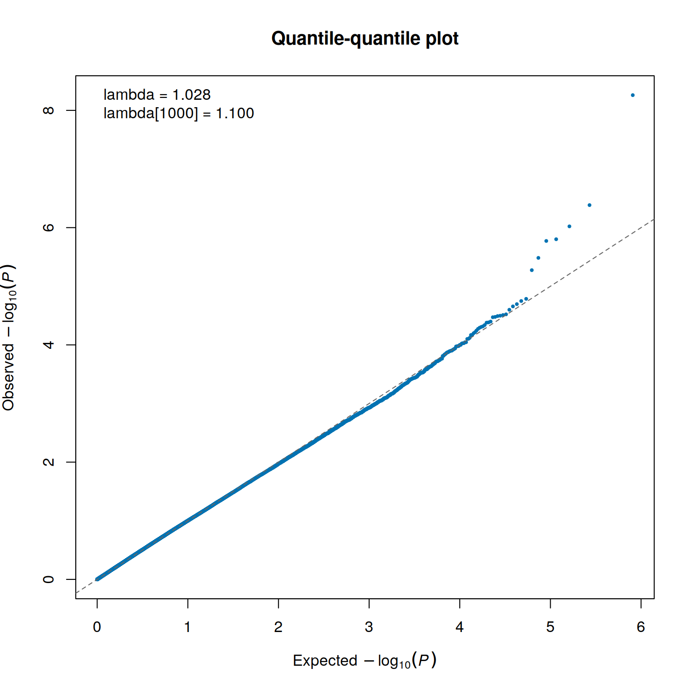
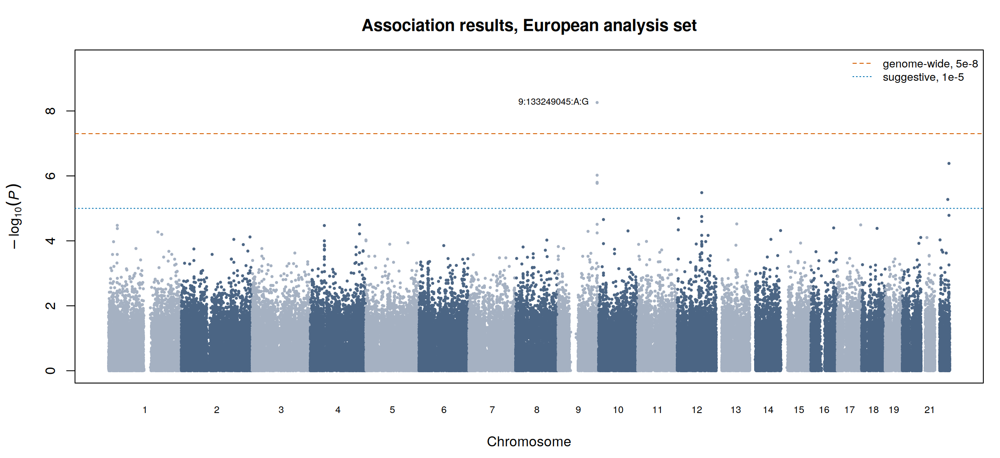
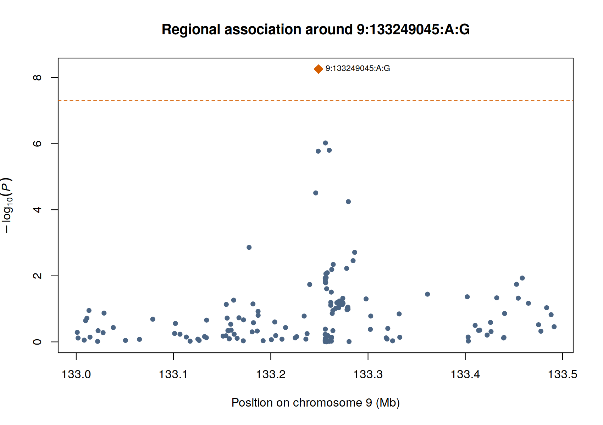

This is the step everything so far has been preparing for: testing each variant for association
with disease status. It is also the shortest step to run and the easiest to misread.

The test itself is a logistic regression, one variant at a time, asking whether carrying more
copies of an allele changes the odds of being a case. What takes judgement is everything around
it: which covariates enter the model, which test handles a small and unbalanced case series, and
how to tell a result worth reporting from a result worth investigating.

```bash
~/gwas_tutorial/
├── demo_data/
├── scripts/04A_association_binary/
└── results/assoc/
```

::: {.callout-tip title="Before you start"}
Finish [Population stratification](../02_population_stratification/02_population_stratification.qmd)
first. You need `results/pca/pdac_demo_02_pca_eur.eigenvec` and
`results/pca/pdac_demo_02_eur_keep.txt`.
:::

---

## 01 - Assembling the covariates

**Why.** Covariate adjustment is the mechanism by which the confounding found in Section 2 is
actually removed. A principal component that is computed and then not used has corrected nothing.

```bash
Rscript scripts/04A_association_binary/01_make_covariates.R
```

This merges sex and age with the ten within-Europe components, and additionally tests each
component against case status in a model containing sex and age. On the demonstration data
**no component is associated with status**, which is what a single-ancestry analysis set should
look like.

::: {.callout-important title="What it means if several components are strongly associated"}
It means something differs systematically between cases and controls along the axes of genetic
variation. In a well-designed study that is residual ancestry, and adding components helps. In a
multi-centre study it is often recruitment: cases from one country, controls from another. No
number of principal components repairs a design in which cases and controls were drawn from
different populations. Diagnose it here, before the association test, not afterwards.
:::

---

## 02 - Running the test

```bash
bash scripts/04A_association_binary/02_association.sh
```

Three parts of that command are worth understanding.

**`--glm firth-fallback`.** Ordinary logistic regression breaks down when a variant is rare, when
cases are few, or when a genotype almost perfectly separates cases from controls: the estimate
diverges and the P value cannot be trusted. Firth's penalised likelihood fixes this. The fallback
form uses ordinary regression by default and switches to Firth only where it is needed. On the
demonstration data Firth is invoked for **2,289** variants, all of them low-frequency. With a few
hundred cases this is not a refinement, it is a requirement.

**`--covar-name SEX,AGE,PC1...PC10`.** The adjustment set. In a multi-centre study, recruitment
centre or genotyping batch belongs here too, as a categorical term.

**`--chr 1-22`.** Autosomes only. The chromosome X in this dataset is simulated so that the sex
check in Section 1B has something to act on, and carries no phenotype signal. PLINK 2 also models
sex itself on chrX, which collides with sex as a user covariate and stops the run with a
`CORR_TOO_HIGH` error. Analysing chrX properly is a real task with its own rules and is out of
scope here.

::: {.callout-note title="When PLINK 2 is not the right tool"}
For a single, moderately imbalanced, essentially unrelated cohort of this size, logistic
regression with a Firth fallback is adequate and transparent. Two situations call for something
else. Where relatedness is extensive enough that pruning would cost a substantial share of cases,
retain those individuals and use a mixed model or whole-genome regression: SAIGE or REGENIE.
Where a modest case series is merged with a very large external control set, increasingly common
with biobank controls, a saddlepoint-corrected method is required rather than optional, because
standard asymptotics fail at those ratios.
:::

The log reports what was actually analysed. On the demonstration data: **224 cases and 387
controls**.

---

## 03 - Checking the result before believing it

**Why.** Before looking at any peak, check whether the test statistics as a whole behave as they
should under the null. This is what catches residual structure, cryptic relatedness and batch
effects.

```bash
Rscript scripts/04A_association_binary/03_qq_lambda.R
```



Points should follow the diagonal, lifting off only in the extreme upper tail where true
associations live. A curve that rises above the line along its whole length means inflation
affecting every variant, which is a property of the analysis rather than of biology.

On the demonstration data **λ = 1.028**, and λ₁₀₀₀ = 1.100.

::: {.callout-warning title="Compute lambda correctly"}
`lambda = median(qchisq(1 - P, df = 1)) / qchisq(0.5, df = 1)`

Compute it this way. During the construction of this very dataset, an earlier version calculated
it by sorting test statistics in `awk`; the code was wrong and reported a convincing inflation
signal that did not exist. It cost a day of chasing a problem that was not there.
:::

::: {.callout-note title="Reading lambda in a small study"}
Lambda scales with sample size under genuine polygenicity, so it must be read relative to the
size of the study. With a few hundred cases it is estimated with considerable uncertainty, and
1.05 can be entirely compatible with a well-controlled analysis. λ₁₀₀₀, rescaled to 1,000 cases
and 1,000 controls, is the figure comparable across studies. Note also that inflation and
deflation have different causes and different remedies, and lambda alone does not tell you which
is operating.
:::

---

## 04 - The Manhattan plot

```bash
Rscript scripts/04A_association_binary/04_manhattan.R
```



One peak. Everything else is flat.

If you have followed a tutorial built on a well-powered common-disease cohort, you have seen a
dozen peaks and you may read this plot as a failed analysis. It is not. The phenotype here was
simulated from a **single causal locus** at *ABO* with no polygenic background, so one signal is
the correct answer and the flat genome is the true one.

The deeper point is the one this guide exists to make. At an effective sample size of 568, the
smallest odds ratio detectable with 80% power at genome-wide significance is about 2.3 even for a
common variant, and it rises steeply as frequency falls. Real cancer susceptibility variants have
odds ratios between 1.1 and 1.5. A study of this size could not have found them however well it
was conducted. The scan is sound; it is simply not powered, and those are different things.

::: {.callout-note title="The two thresholds"}
**5 × 10⁻⁸** is approximately a Bonferroni correction for one million independent tests in
European-ancestry data. It is somewhat conservative for a single ancestry and anticonservative
for trans-ancestry analyses, where LD blocks are shorter.

**1 × 10⁻⁵** is the conventional suggestive line: **7 variants** here. These are not findings and
must never be presented as such. But in a rare cancer, discarding them entirely also discards the
most plausible candidates for the next consortium round. Report them transparently, flagged as
requiring replication, next to the power curve that explains why the study could not resolve
them.
:::

---

## 05 - The top locus, and what its effect size is worth

```bash
Rscript scripts/04A_association_binary/05_summary.R
```

::: {.panel-tabset}

### Regional view



This plot is what tells you whether a peak is real. A genuine association appears as a cluster:
the lead variant surrounded by correlated neighbours with progressively weaker signal, because
linkage disequilibrium carries the signal to them. A single isolated point with nothing around it
is usually a genotyping artefact and should be checked in the cluster plots before it is
believed.

### Lead variant

| | |
|---|---|
| Variant | 9:133249045:A:G, at *ABO* (9q34.2) |
| Effect allele | G, frequency 0.0855 |
| Odds ratio | 3.90 (95% CI 2.47 to 6.15) |
| P | 5.5 × 10⁻⁹ |

*ABO* is the most robustly replicated PDAC susceptibility locus, and it is the locus the
phenotype was simulated from. Recovering it is the positive control: it confirms the pipeline
works end to end.

:::

::: {.callout-important title="The effect size is wrong, and knowing by how much is the lesson"}
The simulated odds ratio at this variant is **2.40**. The analysis recovered **3.90**, with a
confidence interval whose lower bound, 2.47, sits just above the truth. The estimate is inflated
by roughly 62%.

This is the **winner's curse**. When an effect size is read from the same underpowered scan that
discovered it, only upward fluctuations cross the significance threshold, so surviving estimates
are systematically too large. What is unusual here is that the truth is known, so the bias can be
measured instead of merely anticipated.

In a real study the same distortion operates invisibly. Effect estimates from a discovery scan
should not be carried into risk prediction, into meta-analytic weighting, or into the power
calculation for a replication study without correction. Where replication data exist, take effect
sizes from the replication or the combined analysis.
:::

---

## Key decisions on this page

- Additive model versus alternatives, and the covariate set.
- Firth fallback versus a saddlepoint-corrected whole-genome regression, chosen on imbalance and
  relatedness rather than habit.
- The interpretation of λ relative to sample size, and which of inflation's several causes is
  operating.
- The significance thresholds, and the explicit status assigned to suggestive results.
- Whether an effect estimate is fit to be reused downstream, or whether the winner's curse makes
  it fit only for reporting.

## What comes next

A single underpowered cohort is where most rare-cancer studies start, not where they end. The
result above is a legitimate contribution to a meta-analysis that will eventually have power, and
producing it correctly, with full summary statistics and documented decisions, is what makes that
contribution usable.
