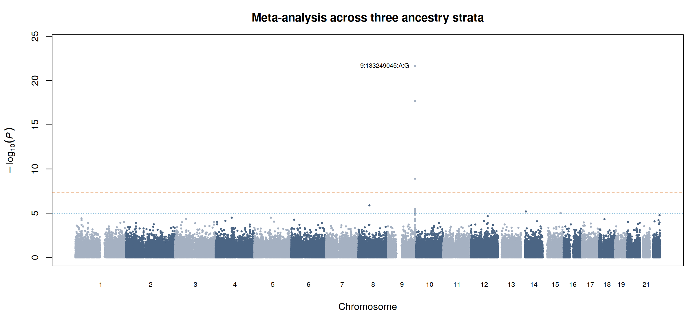
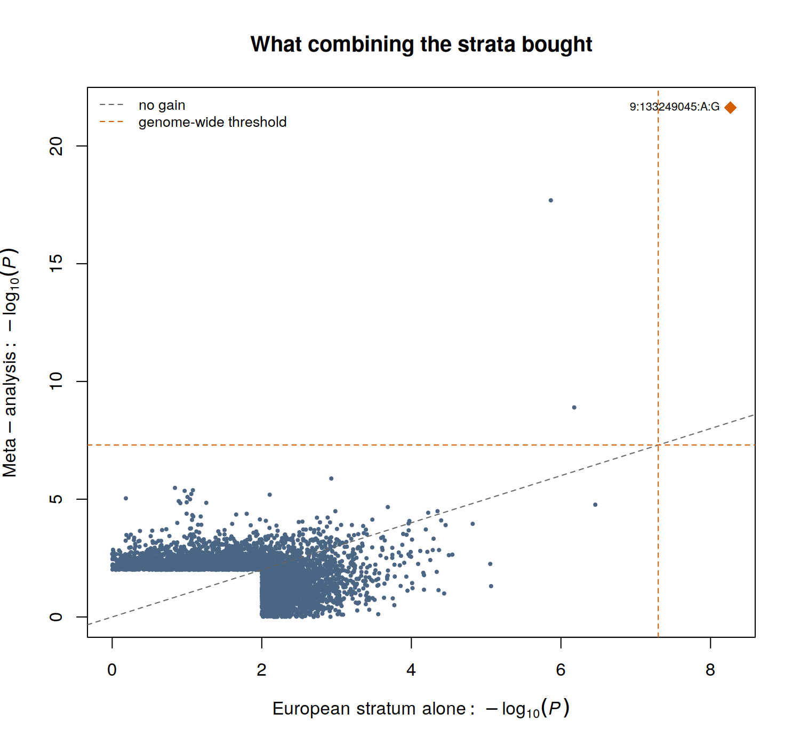
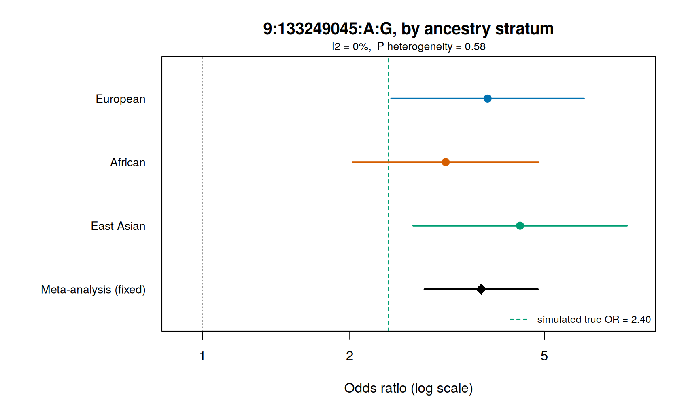
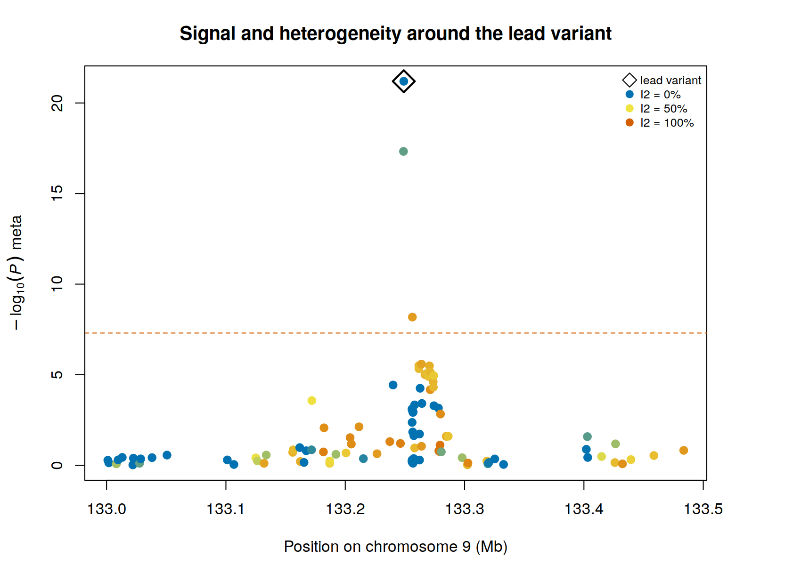

A single cohort of a few hundred cases cannot find a variant with an odds ratio of 1.2. That is
not a failure of analysis, it is arithmetic, and Section 4A showed it: one signal, and only
because the demonstration data were built with an implausibly strong one.

Meta-analysis is how the field gets round this. Studies that are individually underpowered
combine their summary statistics, and the combined evidence reaches a threshold that none of them
could reach alone. For rare cancers it is not an optional extra at the end of the pipeline; it is
the reason a single-cohort analysis is worth doing at all.

This page demonstrates it on the three ancestry groups of the demonstration dataset, analysed
separately and then combined.

```bash
~/gwas_tutorial/
├── demo_data/
├── scripts/05_meta_analysis/
└── results/meta/
```

::: {.callout-warning title="What this demonstration is, and what it is not"}
The three strata here are ancestry groups **within one genotype file**, not independently
recruited and independently genotyped cohorts. They share a variant set, an allele coding, a
genome build and a single simulated phenotype model, and no individual appears twice.

That makes the demonstration clean, and in one respect misleadingly so: the harmonisation
problems that consume most of the effort in a real meta-analysis cannot arise here. Step 02 runs
all of the checks in full anyway, precisely because a script that assumes agreement will never
find the disagreement. Where a check passes trivially, the page says so.

What the demonstration does show honestly is the statistical machinery: inverse-variance
weighting, heterogeneity, fixed versus random effects, and the size of the gain.
:::

::: {.callout-tip title="Before you start"}
Finish [Association testing](../04A_association_binary/04A_association_binary.qmd). You need
`results/qc/pdac_demo_08_filt` and the demonstration phenotype and covariate files.
:::

---

## 01 - Analysing each stratum separately

**Why not simply pool everyone into one regression?** Because that assumes each variant has the
same effect in every group, and that principal components can absorb the frequency differences
between them. Neither is safe. Causal-allele frequencies and linkage disequilibrium differ
between populations, so a marker can tag a causal variant well in one group and poorly in
another. Stratifying makes no such assumption, and it makes the differences visible and testable
instead of hiding them inside one pooled estimate.

```bash
bash scripts/05_meta_analysis/01_stratified_gwas.sh
```

Each stratum gets its own LD pruning, its own principal components and its own association test.

| Stratum | Individuals | Cases | Controls | Effective N |
|---|---|---|---|---|
| European | 611 | 224 | 387 | 567.5 |
| African | 290 | 139 | 151 | 289.5 |
| East Asian | 316 | 141 | 175 | 312.3 |
| **Combined** | **1,217** | **504** | **713** | **1,169.4** |

Notice the African stratum. It has fewer than half the individuals of the European one, but
because its case-control ratio is nearly balanced it contributes an effective sample size of 290
against 568: proportionally far more per participant. Effective sample size, not headline count,
is what a meta-analysis is really combining.

::: {.callout-note title="Five components, not ten"}
Section 4A used ten principal components in the European stratum. Here every stratum uses five,
because estimating ten components in fewer than 320 individuals spends parameters the data cannot
support, and because the strata must be treated identically for their results to be comparable.

This gives a free stability check, one of the three the guide recommends. In the European
stratum, the lead variant's P value is 5.50 × 10⁻⁹ with ten components and 6.72 × 10⁻⁹ with five.
The choice does not matter here, and now we know that rather than assuming it.
:::

---

## 02 - Harmonisation, where the errors actually are

**Why.** This step does no statistics. It exists because the commonest failures in meta-analysis
are bookkeeping failures, and they are silent: the numbers still combine, the plot still looks
plausible, and the effect points the wrong way.

```bash
Rscript scripts/05_meta_analysis/02_harmonise.R
```

::: {.callout-important title="The demonstration found a real one"}
Comparing the effect allele across strata, the script had to flip the sign of the effect estimate
for **37,731** variants in the African stratum and **35,822** in the East Asian one. Roughly one
variant in seven.

These strata came from *the same genotype file*. The cause is that PLINK 2 reports the effect
allele as the minor allele **in the sample being analysed**, and which allele is minor changes
between populations. At `1:817341:A:G`, G has frequency 0.16 in the European stratum and is the
minor allele; in the African stratum G reaches 0.70, so A becomes minor and the reported effect
refers to the other allele.

Combining those numbers without aligning them would have cancelled real signal and manufactured
false signal, and nothing in the output would have looked wrong. If this can happen within a
single file, it will certainly happen across cohorts genotyped in different laboratories a decade
apart. **Always align on an explicitly named effect allele, never on column position or on the
assumption that two files agree.**
:::

The other three checks the script performs:

**Strand ambiguity.** At A/T and C/G variants the effect allele cannot be resolved by comparing
alleles, because A complements T and C complements G. Here 1,640 variants (0.6%) are ambiguous,
339 of them with frequency between 0.4 and 0.6, where frequency cannot resolve them either. They
are flagged. Many consortia simply exclude ambiguous variants in that frequency band.

**Effect-size scale.** A log odds ratio, an odds ratio and a linear-model beta cannot be averaged
together. Confirm what each contributing study reported, in writing, before combining anything.

**Sample overlap.** If the same individuals appear in two contributing studies the estimates are
correlated, the fixed-effect standard error is too small, and significance is inflated. This
cannot be detected from summary statistics; it has to come from the study descriptions.

::: {.callout-note title="Fewer variants than you started with"}
The European analysis tested 394,627 variants. Only **268,393** are present in all three strata,
because a variant that is monomorphic in one population cannot be tested there. A real
meta-analysis usually keeps such variants, combining each across whatever studies carry it and
reporting the study count per variant. This demonstration takes the simpler route of using the
intersection, which is why the meta-analysis has fewer variants than the single-stratum scan.
:::

---

## 03 - Combining the strata

```bash
Rscript scripts/05_meta_analysis/03_meta_analysis.R
```

**Fixed effects.** Each stratum is weighted by its precision, `w = 1/SE²`:

$$\beta_{\text{meta}} = \frac{\sum w_i \beta_i}{\sum w_i}, \qquad \text{SE}_{\text{meta}} = \sqrt{\frac{1}{\sum w_i}}$$

This is inverse-variance weighting, what METAL and GWAMA do. The arithmetic is written out in the
script so that the reader can see it rather than trust it.

**Heterogeneity.** Cochran's Q asks whether the strata differ by more than sampling error would
produce; I² expresses the same information as a percentage of total variation.

**Random effects.** Allows the true effect to differ between strata, estimating the between-study
variance by DerSimonian-Laird and widening the interval. Reported alongside the fixed-effect
result, not instead of it, because the comparison is what tells you whether the model choice
changes the conclusion.

### The result

| | European stratum, 5 PCs | Meta-analysis |
|---|---|---|
| Lead variant P | 5.4 × 10⁻⁹ | **6.3 × 10⁻²²** |
| Genome-wide significant | 1 | 3 |
| Suggestive (P < 1 × 10⁻⁵) | 8 | 11 |
| λ | 1.022 | 1.006 |

Thirteen orders of magnitude at the causal variant, from roughly doubling the effective sample
size. That is the whole argument of this guide in one line: the single-cohort analysis was sound
but nearly uninformative, and it became informative by being combined.





Each point is a variant, its European P value against its meta-analysis P value. Most sit near
the diagonal; the causal variant is far above it. Points *below* the diagonal are variants where
the additional strata argued against the European result, which is equally informative.

---

## 04 - Reading the disagreement

```bash
Rscript scripts/05_meta_analysis/04_meta_plots.R
```



The lead variant, stratum by stratum. The odds ratios are 3.83 in Europeans, 3.14 in Africans and
4.46 in East Asians, with a combined estimate of 3.71 and confidence intervals that overlap
heavily. I² = 0%, heterogeneity P = 0.58: the strata agree, and the fixed-effect model is
appropriate.

The dashed green line marks the true simulated odds ratio, 2.40. Every stratum overestimates it,
and so does the meta-analysis. This is the winner's curse from Section 4A, and meta-analysis does
not cure it: combining biased discovery estimates gives a more precise biased estimate. The
remedy is replication in data not used for discovery, not more of the same data.

::: {.callout-important title="Where heterogeneity comes from, and what it means"}


Look at the pattern rather than the peak. The causal variant, the open diamond, has I² = 0: it
behaves identically in all three populations, because it *is* the cause and its effect does not
depend on ancestry.

Its correlated neighbours do not. At `9:133256264` I² reaches 77.8% and the heterogeneity P value
is 0.011. Under fixed effects that variant looks genome-wide significant at 6.6 × 10⁻⁹; under
random effects its P value collapses to 0.0040.

Nothing is wrong with the data. Those variants are not causal, they merely tag the causal variant
through linkage disequilibrium, and LD structure differs between populations, so how well they
tag it differs too. **Strong heterogeneity at a proxy with none at the lead is a signature of a
shared causal variant seen through different LD**, and it is a reason to fine-map per ancestry
rather than pooled (Section 6).

Across all 268,393 variants, 5.0% have a heterogeneity P below 0.05, against the 5% expected by
chance alone. Genome-wide there is no excess: the heterogeneity is concentrated exactly where the
signal is.
:::

---

## Key decisions on this page

- Stratify and combine, or pool with covariates. Stratify whenever each group can support its own
  analysis, and always when the groups are different ancestries.
- Fixed or random effects. Report both. Where they disagree, the disagreement is the finding.
- Which variants to carry: the intersection across studies, or every variant with the number of
  contributing studies recorded. The second is better practice and needs a per-variant study
  count in the output.
- How to treat strand-ambiguous variants: flag, or exclude in the ambiguous frequency band.
- Whether contributing studies share individuals. Establish this from the study descriptions
  before running anything; it cannot be recovered afterwards.

## The pitfalls checklist

1. **Effect allele.** Align explicitly, by allele name. This demonstration needed 73,553 sign
   flips within a single genotype file.
2. **Strand.** A/T and C/G variants near 50% frequency cannot be resolved. Flag or drop them.
3. **Scale.** Log odds ratio, odds ratio and linear beta are not interchangeable.
4. **Overlap.** Shared individuals inflate significance and are invisible in summary statistics.
5. **Build.** Confirm every study is on the same genome build before matching by position.
6. **Weights.** Weight by precision, not by participant count.
7. **Heterogeneity.** Report it per variant. Do not average away a difference that is telling you
   something.

Fine mapping, the next step, takes the credible set at this locus and asks which of the
correlated variants is the causal one. The heterogeneity pattern above is already the first piece
of evidence: the variant with no heterogeneity is the one behaving like a cause.
