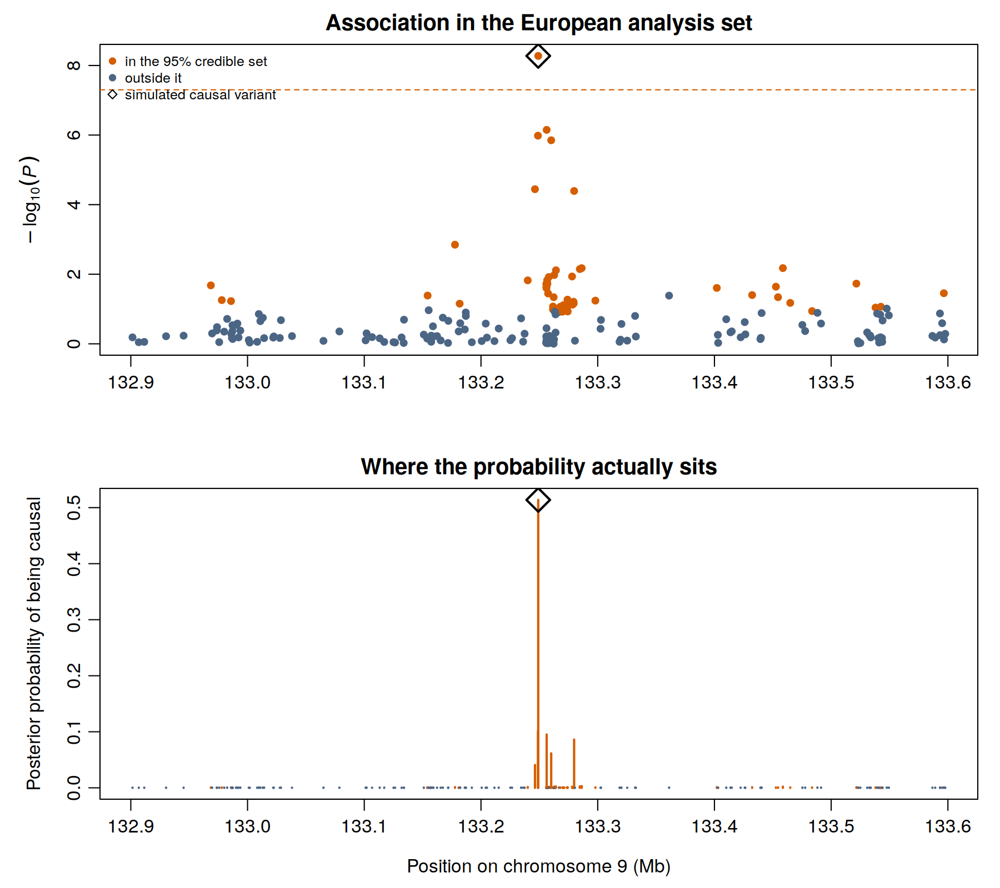
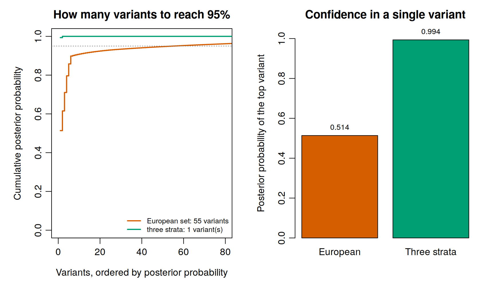

An association peak is not a finding about one variant. Nearby variants are inherited together, so
a single causal variant drags its neighbours up with it and the association test cannot tell them
apart. In the European analysis set the *ABO* signal is carried by dozens of variants, and the one
with the smallest P value is not necessarily the cause.

Fine mapping asks which of them it is, and answers with a **credible set**: a shortlist that,
under the assumptions of the method, contains the causal variant with a stated probability.

```bash
~/gwas_tutorial/
├── scripts/06_finemapping_annotation/
└── results/finemap/
```

::: {.callout-tip title="Before you start"}
Finish [Association testing](../04A_association_binary/04A_association_binary.qmd). The
comparison at the end of this page also uses the output of
[Meta-analysis](../05_meta_analysis/05_meta_analysis.qmd).
:::

::: {.callout-note title="Something this page can check that a real study cannot"}
The demonstration phenotype was simulated from a known causal variant, `9:133249045:A:G`. Every
statement below can therefore be scored against the truth: does the credible set contain it, and
where does it rank? On real data you never know this. Take the opportunity while it lasts.
:::

---

## 01 - The region and its linkage disequilibrium

```bash
bash scripts/06_finemapping_annotation/01_region_and_ld.sh
```

Two inputs are needed: the association statistics for a window, and the correlations between the
variants in it.

**Choosing the window.** Wide enough to contain the signal and its flanks, narrow enough that
assuming a single cause is plausible. A few hundred kilobases either side of the lead variant is
conventional; here 132.9 to 133.6 Mb on chromosome 9, which contains **198 variants**.

That number is worth pausing on. A genotyping array carries a couple of hundred markers in a
700 kb window, and the resolution of any fine mapping is bounded by what was measured. Imputation
raises the count but not the information.

::: {.callout-important title="Which linkage disequilibrium, and why it is the commonest way to be confidently wrong"}
In-sample LD, computed from the genotypes actually analysed, is correct whenever individual-level
data are available, and it is what this page uses. With summary statistics only, an external
reference panel is substituted and **must match the ancestry of the study**. A European reference
used for an African or admixed sample produces a credible set that is precise, plausible and
wrong. If the analysis reaches this point with a mismatched reference, nothing downstream will
signal the error.
:::

---

## 02 - Posterior probabilities and the credible set

```bash
Rscript scripts/06_finemapping_annotation/02_finemap_abf.R
```

The script implements Wakefield's approximate Bayes factor in a few readable lines. For each
variant, from its estimate `b` and standard error `s`:

$$r = \frac{W}{W + s^2}, \qquad \log \text{ABF} = \tfrac{1}{2}\left(\log(1-r) + \frac{r\,b^2}{s^2}\right)$$

Normalising across the region gives each variant a posterior probability of being the causal one.
Ranking by that probability and taking variants until they sum to 0.95 gives the 95% credible set.

::: {.callout-warning title="The assumption that decides whether this method is appropriate"}
This method assumes there is **exactly one** causal variant in the region. Where a locus carries
two independent signals it will not find them: it returns a single set that mixes both, or follows
whichever is stronger.

In PDAC that is not hypothetical. *TERT-CLPTM1L* carries multiple independent signals in a narrow
window, and collapsing them into one lead variant would misassign any mechanism inferred later.
Methods that allow several causal variants, SuSiE, FINEMAP and CAVIAR among them, return one
credible set per signal and are the right choice whenever multiplicity is plausible or the sample
is large enough to resolve it.

The single-variant method is used here because it can be written out and read in full, and because
at this sample size a second signal would not be detectable anyway. Say which you used, and why.
:::

**The prior matters and should be stated.** `W` is the prior variance of the effect on the log
odds scale. The value used here, 0.04, places most weight on odds ratios between roughly 0.67 and
1.5, the range of genuine cancer susceptibility effects. A prior centred on larger effects shifts
probability towards rarer variants, and conversely.

### The result in the European set

| | |
|---|---|
| Variants in the region | 198 |
| Variants in the 95% credible set | **55** |
| Top variant | `9:133249045:A:G`, posterior probability 0.51 |
| Simulated causal variant in the set | yes, ranked first |

The method puts the true causal variant at the top, which is reassuring, and then spreads the
remaining half of the probability across 54 other variants, which is the honest part. A credible
set of 55 variants is not a shortlist for functional work. It is a statement that at this sample
size the locus cannot be resolved further.



The lower panel is the one to read. Probability is not concentrated on a peak, it is scattered
across the region, because the causal variant is correlated with many others and the data cannot
distinguish them.

---

## 03 - What combining ancestries does

```bash
Rscript scripts/06_finemapping_annotation/03_finemap_plots.R
```

Running the same method on the three-stratum meta-analysis of
[Section 5](../05_meta_analysis/05_meta_analysis.qmd) gives a different picture.



| | European set | Three strata combined |
|---|---|---|
| Variants in the 95% credible set | 55 | **1** |
| Posterior probability of the top variant | 0.51 | **0.99** |
| Is it the true causal variant | yes | yes |

::: {.callout-important title="Why the set collapses, and why this is not just more power"}
More samples alone would sharpen the P value without necessarily resolving the locus. What
resolves it is that linkage disequilibrium **differs between populations**. A variant correlated
with the causal one in Europeans may not be correlated with it in Africans, so a marker that
cannot be distinguished within one ancestry is distinguished by disagreement between ancestries.
The causal variant is the one that behaves consistently everywhere.

This is the same phenomenon seen from the other side in Section 5, where the causal variant showed
no heterogeneity while its correlated neighbours reached I² of 79%. Heterogeneity at the proxies
and none at the cause is the signature; here it becomes resolution.

It is also the strongest practical argument for recruiting beyond European ancestry that this
guide can make, and it does not depend on fairness or on generalisability, both of which are true
but are arguments of a different kind. Ancestral diversity is a statistical instrument for
localising causal variants, and a study confined to one ancestry gives that instrument up.
:::

---

## How to report a credible set

Three questions decide what a credible set is worth, and all three belong in the paper.

**How many independent signals?** A single-variant method cannot answer this; a multi-signal
method returns one set per signal and each should be reported and followed up separately.

**How large is each set?** One or two variants near probability 1 is resolved and ready for
targeted experimental work. Tens of variants across a wide window means the locus is unresolved,
and the correct next step is more data or more ancestral diversity, not a more elaborate method.

**What is the functional context?** Consequence and regulatory overlap set the priority of each
set, and are the subject of the annotation section that follows.

Report the method, the prior, the LD source and its ancestry, the coverage, the size of each set,
and the posterior probability of the top variant. A credible set given as a bare list of variant
identifiers cannot be evaluated by anyone.

## Key decisions on this page

- The window: wide enough for the signal, narrow enough for the assumption.
- Single causal variant or several, decided on the plausibility of multiplicity and on power, not
  on which software is familiar.
- The LD source, and whether its ancestry matches the study. This is the decision that most often
  produces an answer that is confident and wrong.
- The prior on effect size, stated rather than left at a default.
- Whether the credible set is small enough to justify functional follow-up, or whether the honest
  report is that the locus remains unresolved.
